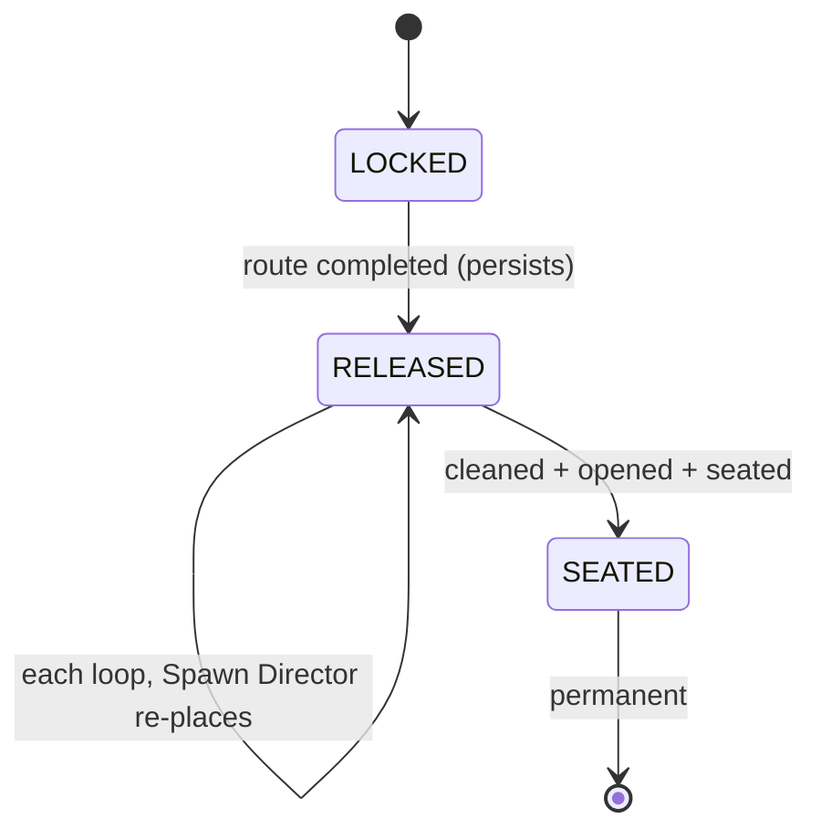
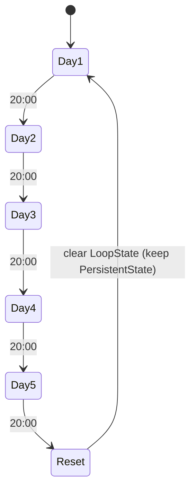
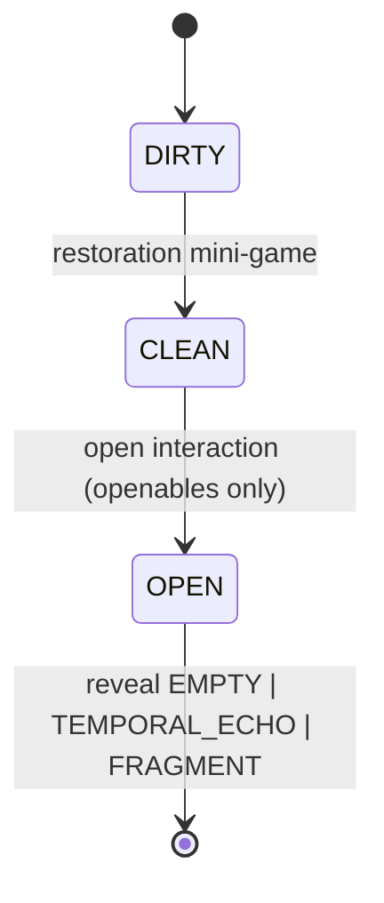
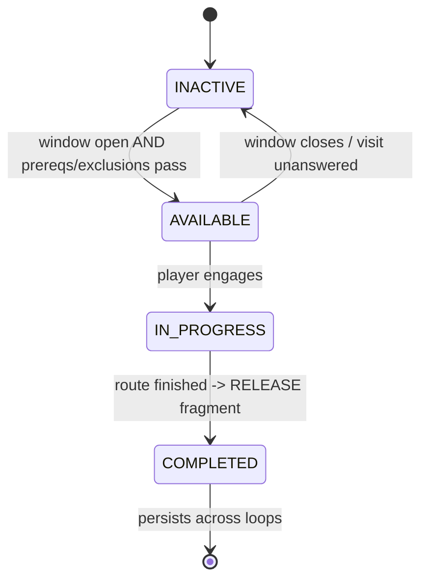

# PRD.md — aLima

**Product Requirements Document · the development reference for building *aLima*.**

| | |
|---|---|
| **Project** | aLima — cozy AI-powered historical-restoration roguelite |
| **Event** | AI Game On! · AI Fest 2026 · Iloilo City |
| **Stack** | Godot 4.6.3 (typed GDScript) · hybrid 3D shop + 2D interfaces · Node/Express backend · JSON/`.tres` data |
| **Companion docs** | `CLAUDE.md` (operating spine + invariants) · `README.md` (GDD/design/narrative) · `docs/phase-task.md` (implementation order/status) |

> **How to use this doc.** This is the buildable spec. Every requirement has an **ID** (e.g. `SCAN-R3`) — reference them when directing implementation ("build `PORT-R1..R4`"). Each system carries a **priority**: `P0` = June 30 slice, `P1` = finalist core, `P2` = polish. Authority order is **`CLAUDE.md` §4 invariants → this PRD → `README.md` GDD → `docs/phase-task.md` implementation tracker**. Where this conflicts with the GDD, this wins for build detail. **Section 12 is the complete discovery specification** for the Spawn Director, Cultural Echoes, and carriers.

---

## Contents

1. Purpose & Scope
2. Goals & Milestone Scope (P0/P1/P2)
3. System Architecture
4. Data Models (canonical schemas)
5. Persistence & The Loop
6. Day Clock & Loop Controller
7. Delivery & Triage
8. Restoration (mini-games · tools vs techniques)
9. AI Object Scanner
10. AI Marketplace
11. The Journal
12. Discovery Subsystem (Spawn Director · Echoes · Carriers)
13. Portal Integration & Found/Unlock Flow
14. Digital Museum
15. Character Routes & Scheduling
16. Temporal Echoes
17. Mini-Events
18. The Safe & Locked Drawer
19. Endings & the Perfect Loop
20. Backend API Reference
21. State Machines
22. Build Sequencing & Definition of Done
23. Open Decisions

---

## 1. Purpose & Scope

aLima is a single-player game where the player runs a junk shop across a repeating **five-day loop**, rescuing and restoring discarded objects, authenticating them with an AI scanner, selling or preserving them, and — across loops — recovering the **five fragments** of a regional heritage artifact (the "Master Artifact") to break the loop.

**In scope for this PRD:** all runtime game systems, their data contracts, the backend services they depend on, and the build sequence to the June 30 slice and the finalist phase.
**Out of scope:** narrative prose/dialogue text (lives in `data/` + GDD), final art/audio asset production, and the final Master Artifact selection (pending; see §23).

---

## 2. Goals & Milestone Scope

### 2.1 Product goals
- **G1.** Discovery flows *through* restoration — the player cleans and opens objects to find fragments, never bypasses it.
- **G2.** Progression is **knowledge, not resources** — the loop wipes money/stock; understanding persists.
- **G3.** **AI assists, the player judges** — the scanner suggests; the player decides.
- **G4.** Every required jam mechanic is real and demonstrable (procedural placement, Cultural Echoes, Portal Unlock, Digital Museum).
- **G5.** Stays **artifact-agnostic** until the artifact is locked.

### 2.2 Priority legend
| Tag | Meaning |
|---|---|
| **P0** | Required for the **June 30 vertical slice** (50% video) |
| **P1** | Required for a complete finalist build |
| **P2** | Polish / stretch |

### 2.3 Slice (P0) summary
One hybrid 3D shop space with 2D gameplay interfaces; delivery + triage; **one** fully-built carrier (the pendant) with clean→open; Spawn Director v1 (genuine carrier+container+day rolls, per-player never-twice); Echo mixer v1 (4 bands + resonance meter + captions); cached scanner v1; Artifact Found → mock Portal → Portal Unlock → persisted museum record → journal seat (5-slot case, one slot fills); journal v1; the Elderly-Auntie photo beat as a scripted emotional showcase. Everything else is P1/P2.

---

## 3. System Architecture


**Architecture requirements**
- **ARCH-R1 (P0).** All LLM/Portal calls go through the backend. The client never holds an API key. *(Invariant — CLAUDE.md §4-K.)*
- **ARCH-R2 (P0).** Backend wraps every external call with a timeout and a **cached fallback** response, so the client degrades gracefully and the exhibit build never depends on venue internet.
- **ARCH-R3 (P0).** Portal calls target a config-selected base URL: `mock-portal` in dev, real Portal in prod. Swapping is a single env/config change. *(Invariant §4-K / §13.)*
- **ARCH-R4 (P0).** Client↔system communication is via **signals/events**, not hard cross-references, so systems are independently testable. *(Convention — CLAUDE.md §7.)*
- **ARCH-R5 (P0).** All object/fragment/route/echo definitions load from `data/` or `resources/`. No hardcoded artifact specifics anywhere in logic. *(Invariant §4 / G5.)*

---

## 4. Data Models

These are the **canonical schemas**. This section is the contract everything else builds on. GDScript shown; persisted data may serialize to JSON. Fields marked *(persist)* survive loop resets (see §5).

### 4.1 ScrapObjectTemplate — authored definition (`data/objects/*.json`)
```gdscript
class ScrapObjectTemplate:
    var id: String                       # "pocket_watch", "tarnished_pendant"
    var display_name: String
    var category: String                 # "jewelry" | "paper" | "mechanical" | "ceramic" | ...
    var base_rarity: Rarity              # WHITE..GOLD (apparent glow; can mislead)
    var weight_range: Vector2            # grams, for authenticity checks
    var materials: Array[String]
    var is_openable: bool
    var openable_type: String            # "" if not openable; else "pendant"|"tin"|"santo"|"frame"|...
    var required_clean_tool: String      # tool id needed to clean
    var clean_minigame: String           # which mini-game (REST §8)
    var base_value_range: Vector2        # pesos, honest market value
    var counterfeit_profile: String      # ref to a CounterfeitProfile id, or ""
    var historical_fact_ref: String      # ref for scanner/museum context, or ""
    var can_hold_temporal_echo: bool
```

### 4.2 ObjectInstance — runtime (one per delivered item, loop-scoped)
```gdscript
class ObjectInstance:
    var template_id: String
    var uid: String                      # unique this loop
    var condition: int = 0               # 0..100, raised by restoration
    var state: ObjState                  # DIRTY | CLEAN | OPEN
    var is_carrier: bool = false         # set by Spawn Director (DISC)
    var fragment_id: String = ""         # payload if carrier
    var contents: Contents = EMPTY        # EMPTY | TEMPORAL_ECHO | FRAGMENT
    var authenticity: Authenticity        # UNKNOWN | AUTHENTIC | REPLICA | MODIFIED | UNCERTAIN
    var is_counterfeit_truth: bool        # ground truth (player must discover)
```

### 4.3 Fragment *(persist)*
```gdscript
class Fragment:
    var id: String                       # "frag_1".."frag_5"
    var master_artifact_id: String
    var owning_character_id: String      # who holds/releases it
    var case_slot_index: int             # 0..4 in the journal case
    var state: FragmentState             # LOCKED | RELEASED | SEATED
    var echo_set_ref: String             # which EchoSet guides to it
    var historical_fact_ref: String      # unlocked fact on discovery
```

### 4.4 MasterArtifact — artifact-agnostic definition
```gdscript
class MasterArtifact:
    var id: String
    var display_name: String             # placeholder until locked (§23)
    var fragment_ids: Array[String]      # exactly 5
    var assembled_history_ref: String
```

### 4.5 CharacterRoute
```gdscript
class CharacterRoute:
    var id: String                       # "auntie","artisan","scavenger","archeologist","buyer","yuyu"
    var display_name: String
    var schedule: Array[VisitWindow]     # day + start/end hour
    var prerequisites: Array[String]     # route ids / flags required
    var mutual_exclusions: Array[String] # route ids that cannot co-occur this loop
    var holds_fragment_id: String        # "" for yuyu (finale)
    var rewards: Array[String]           # reward ids
    var has_ending: bool                 # buyer=false, yuyu=finale

class VisitWindow:
    var days: Array[int]                 # e.g. [1,3,5]
    var start_hour: int                  # 24h
    var end_hour: int
```

### 4.6 EchoSet *(per fragment)*
```gdscript
class EchoSet:
    var id: String
    var hum_stream: String               # asset ref
    var melody_stream: String
    var voice_stream: String             # Kinaray-a phrase audio
    var voice_caption: String            # subtitle + translation
    var heartbeat_stream: String
```

### 4.7 JournalEntry *(persist)* — Purple-and-below archive
```gdscript
class JournalEntry:
    var template_id: String
    var origin: String
    var materials: Array[String]
    var weight_range: Vector2
    var clean_method: String
    var counterfeit_indicators: Array[String]
    var historical_context: String
    var value_range: Vector2
    var best_condition: int              # highest achieved
    var best_sale: int                   # highest price recorded
    var variants_found: Array[String]
    var uncle_notes: String
    var ai_annotations: String
    var temporal_echoes_unlocked: Array[String]
```

### 4.8 MuseumEntry *(persist)* — Gold + Master Artifact archive
```gdscript
class MuseumEntry:
    var artifact_id: String
    var fact_card: String
    var photo_ref: String
    var timeline_entry: String
    var regional_story: String
    var character_memory_refs: Array[String]
```

### 4.9 Tool vs Technique *(Technique persists; shop-bought Tool does not; legacy Tool persists)*
```gdscript
class Technique:                          # PERSIST — knowledge of how
    var id: String
    var enables_minigame: String
    var learned_from: String              # "shop" | character id

class ToolItem:
    var id: String
    var enables: Array[String]            # minigames/quality it unlocks
    var quality: int
    var cost: int
    var is_legacy: bool                   # true => PERSIST (route reward); false => loop-scoped
```
> **Rule (REST-R5):** a mini-game may require a learned **Technique** (persistent) AND an owned **Tool** (loop-scoped unless legacy). Next loop you still *know* the method but may need to re-buy the kit. *(See GDD 9.2 / persistence table.)*

---

## 5. Persistence & The Loop  · P0

The single most consequential system. The save is split at the reset boundary.

```gdscript
class SaveState:
    var persistent: PersistentState      # survives every reset (Chronos-bound)
    var loop: LoopState                  # wiped on reset
```

| `PersistentState` *(survives)* | `LoopState` *(wiped on reset)* |
|---|---|
| `journal_entries` | `money` |
| `techniques_learned` | `inventory` (ordinary items) |
| `scanned_records` | `tool_items` (non-legacy) & temp upgrades |
| `museum_entries` | `marketplace_listings` |
| `story_clues`, `dialogue_flags` | `pending_requests` |
| `route_completion` flags | `day_event_outcomes` |
| `fragments` (incl. `SEATED` + case) | `current_day`, `current_hour` |
| `legacy_items`, `leads` | per-loop instance state |
| `spawn_history` (per-player, per-fragment) | |

**Requirements**
- **SAVE-R1 (P0).** On loop reset, clear `LoopState` only; `PersistentState` is untouched. *(Invariant §4-A.)*
- **SAVE-R2 (P0).** `fragments` seated into the case remain `SEATED` across resets and never re-spawn. *(Invariant §4-B.)*
- **SAVE-R3 (P0).** `spawn_history` is keyed `fragment_id → [(carrier_id, container_id)]` and persists, backing the never-twice guarantee. *(DISC.)*
- **SAVE-R4 (P1).** `route_completion` persists; a completed route stays completed and keeps its fragment `RELEASED` until found.
- **SAVE-R5 (P1).** Legacy tools (`is_legacy=true`) and `leads` persist; shop-bought tools do not.
- **SAVE-R6 (P0).** Saving is atomic (write-temp-then-rename) to survive a crash mid-write.

**Acceptance**
- [ ] Reset wipes money/inventory/listings; journal, museum, techniques, seated fragments, spawn history all remain.
- [ ] A seated fragment never appears in a future delivery.
- [ ] Re-entering a loop with a known lead makes the gated content available earlier (§15).

---

## 6. Day Clock & Loop Controller  · P0

- **CLOCK-R1 (P0).** Time advances at **1 real minute = 1 in-game hour**. Shop day runs **07:00–20:00** (~13 real min); a five-day loop ≈ 1 hour.
- **CLOCK-R2 (P0).** The controller exposes `current_day (1..5)` and `current_hour`, and emits signals on hour change, day change, and loop reset.
- **CLOCK-R3 (P0).** At end of Day 5 → `loop_reset` → `SaveState` reset per §5 → Day 1, 07:00.
- **CLOCK-R4 (P1).** NPC visit windows are checked against the clock; a knock fires only inside a character's window (§15). The player may ignore a knock; an unanswered visitor leaves and that visit is consumed.
- **CLOCK-R5 (P2).** Time can be paused by full-screen UI (mini-game, scanner, negotiation) — design decision flagged in §23 (does cleaning consume in-game time?).

**Acceptance**
- [ ] A full day elapses in ~13 real minutes; loop in ~1 hour.
- [ ] Reset returns to Day 1 07:00 with `LoopState` cleared.

---

## 7. Delivery & Triage  · P0

- **DLV-R1 (P0).** Each morning, generate a delivery: a set of `ObjectInstance`s drawn from templates, weighted by rarity. Includes the carrier(s) placed by the Spawn Director for any `RELEASED` fragment due that day (§12).
- **DLV-R2 (P0).** Storage, time, and money are limited; the player selects which objects to keep before the rest is bulk-recycled (discarded).
- **DLV-R3 (P0).** Each instance shows its **apparent** rarity glow per the fixed legend (§4.1 / Invariant §4-E). The glow reflects *appearance*, not truth — counterfeits can over-glow, treasures can under-glow.
- **DLV-R4 (P1).** Delivery composition responds to mini-events (§17) (e.g., Rush Delivery = larger batch, less time).
- **DLV-R5 (P0).** Pile size stays within the tuned cap (§23 open decision) so "right pile + heartbeat" lands fast, not as a slog.

**Acceptance**
- [ ] Player can keep N and recycle the rest under a storage cap.
- [ ] A Spawn-Director carrier reliably appears in the correct day's delivery/shelf.

---

## 8. Restoration  · P0 (one mini-game) / P1 (full set)

- **REST-R1 (P0).** Restoration is a tactile mini-game raising an instance's `condition` (0→100). Object `state`: `DIRTY → CLEAN`.
- **REST-R2 (P1).** Distinct mini-games per category: brushing, wiping, rust removal, polishing, paper care, frame repair, photo restoration, engraving reveal, mechanism inspection.
- **REST-R3 (P0).** Using the **wrong tool** can erase detail / lower condition / permanently reduce value. Correct tool+technique improves outcome.
- **REST-R4 (P0).** A carrier must reach `CLEAN` before it can be opened. *(Invariant §4-D.)*
- **REST-R5 (P1).** A mini-game may require a learned **Technique** (persistent) and an owned **Tool** (loop-scoped unless legacy) — §4.9.
- **REST-R6 (P1).** Some techniques are learnable only from characters (e.g., the Artisan), not the shop.
- **REST-R7 (P0, slice).** For the slice, build the **one** mini-game the pendant uses; ensure its tool is in the kit at slice start so the demo is always winnable.

**Acceptance**
- [ ] Cleaning raises condition and gates opening.
- [ ] Wrong-tool use is punished (value/condition loss) and recorded.

---

## 9. AI Object Scanner  · P0 (cached) / P1 (live)

- **SCAN-R1 (P0).** After cleaning, the player scans an object. The scanner returns **suggestions**: object type, possible period, detected materials, visible markings, condition, cultural relevance, suggested price range, and signs of modification/counterfeiting.
- **SCAN-R2 (P0).** The scanner **never** sets `authenticity` itself. It surfaces evidence; the player sets the verdict (`AUTHENTIC | REPLICA | MODIFIED | UNCERTAIN`). *(Invariant §4-G.)*
- **SCAN-R3 (P1).** For suspicious items, scanner output is cross-referenced against the journal: a counterfeit may betray itself via wrong weight, modern fasteners, artificial wear, poorly copied engravings, suspicious seller history (`CounterfeitProfile`).
- **SCAN-R4 (P0).** Scanner calls go through `POST /api/scan` (backend, §20); the client never calls the LLM directly. *(Invariant §4-K.)*
- **SCAN-R5 (P0).** The slice ships **cached** scanner annotations for slice objects; live LLM is P1.
- **SCAN-R6 (P1).** Scanner facts derive only from verified records; legend is framed as legend. *(Invariant §4-L.)*

**Acceptance**
- [ ] Scanner output is advisory; the player must choose the verdict.
- [ ] A counterfeit is solvable by comparing scan vs journal — never auto-flagged.

---

## 10. AI Marketplace  · P1

- **MKT-R1 (P1).** The player lists restored items; buyers respond via an AI-driven chat with distinct personas, budgets, and motives (collector, aggressive reseller, budget student, sentimental gift buyer, condition hobbyist, **suspicious buyer** asking about a certain symbol).
- **MKT-R2 (P1).** The player can accept, reject, or haggle/banter; accurate descriptions and honest restoration raise achievable price.
- **MKT-R3 (P1).** Negotiation runs through `POST /api/negotiate` (backend) with **persona + guardrail prompts server-side**. *(Invariant §4-K.)*
- **MKT-R4 (P1).** Selling is the primary economy, but some objects (Gold / Master-Artifact-linked) should be preserved, not sold — the UI nudges this.
- **MKT-R5 (P1).** Best sale price per template updates the journal (`best_sale`).
- **MKT-R6 (P2).** The suspicious buyer ties into the Mysterious-Buyer route (§15) — repeated dealings build toward the fifth fragment.

**Acceptance**
- [ ] At least the listed personas produce distinct, in-character offers.
- [ ] Haggle outcomes reflect restoration quality and description accuracy.

---

## 11. The Journal  · P0

- **JRN-R1 (P0).** The journal is the persistent archive + progression system. Every restored object earns/updates a `JournalEntry` (§4.7).
- **JRN-R2 (P0).** The journal's first page holds the **five-slot Fragment Case**; the player seats each fragment as recovered. Seated fragments persist (§5). *(Invariant §4-B / §4-A.)*
- **JRN-R3 (P0).** **Purple-and-below** finds are archived in the journal; **Gold + Master Artifact** go to the museum (§14). *(Invariant §4-F.)*
- **JRN-R4 (P1).** Mystery pages (Master-Artifact sketches, faded symbols, references to the five) become legible as routes complete and Temporal Echoes are unlocked (§16).
- **JRN-R5 (P0).** AI annotations on entries come from the scanner/backend (verified records), clearly distinguished from the uncle's handwritten notes.

**Acceptance**
- [ ] Restoring an object creates/updates its entry with condition/sale records.
- [ ] Seating a fragment fills a case slot that persists across resets.

---

## 12. Discovery Subsystem  · P0

> This section is the complete discovery specification. **Carrier is a role, not an object type** (§4-C); echoes guide, heartbeat disambiguates; clean→open gate applies.

### 12.1 Spawn Director
- **DISC-R1 (P0).** At loop start, for each `RELEASED` fragment, output a placement `{carrier_instance, outer_container, day}`. (Outer container → carrier → fragment; fragment is always nested in a carrier, never loose.)
- **DISC-R2 (P0).** **Promote** an ordinary openable instance to carrier (set `is_carrier`, `fragment_id`); do not spawn a special object. *(Invariant §4-C.)*
- **DISC-R3 (P0).** **Never-twice:** exclude any `(carrier, container)` pair in `spawn_history[fragment]`; soft-reset (forbidding only the most-recent pair) if exhausted, to avoid deadlock. *(SAVE-R3.)*
- **DISC-R4 (P0).** **Winnable:** never place a fragment behind a tool the player can't obtain that run (hard filter). *(Invariant §4-H.)*
- **DISC-R5 (P0).** **Container compatibility** is a hard filter; **neglect weighting** biases toward containers the player ignores; **day-spread** bonus varies the day. The Safe becomes an eligible outer container only after its code is known; even then, it contains a promoted ordinary carrier and never a loose fragment.
- **DISC-R6 (P0).** Placement draws weighted-random against a per-run seed; log `(seed → placements)` for the demo.

### 12.2 Cultural Echoes
- **DISC-R7 (P0).** Four bands mixed by a `proximity` scalar 0–1: Hum (0–.30) → Melody (.30–.60) → Voice (.60–.85) → Heartbeat (.85–1.0), additive with crossfades.
- **DISC-R8 (P0).** Echoes run **only** when a `RELEASED`, unfound carrier is in the current scene; silence otherwise. *(Invariant §4-I.)*
- **DISC-R9 (P0).** The **Heartbeat band is gated to `is_carrier == true`** — physically impossible on a decoy. It is the disambiguator. *(Invariant §4-E / §4-I.)*
- **DISC-R10 (P0).** Carrier **flicker** (reusing the existing `flickering` glow) only becomes visible at proximity ≥ `GLOW_REVEAL_AT` (0.60) so audio leads, glow confirms. *(Invariant §4-E.)*
- **DISC-R11 (P0).** A **resonance meter** UI mirrors `proximity`; each band has **subtitle captions**; the carrier and meter pulse with the heartbeat — fully playable and demo-legible without audio.

### 12.3 Carriers / openables
- **DISC-R12 (P0).** Opening is a general feature: opening any openable yields `EMPTY | TEMPORAL_ECHO | FRAGMENT`. Only Director-placed carriers yield `FRAGMENT`.
- **DISC-R13 (P0).** Open interaction is type-specific (clasp/pry/unscrew/slide). Build **one** (pendant clasp) for the slice; pool the rest (P1).

**Acceptance (slice-critical)**
- [ ] Three runs of the same fragment yield visibly different carrier + container + day; never a repeat pair for that player.
- [ ] Following the echoes leads to the exact carrier; the heartbeat never fires on a non-carrier.
- [ ] Clean→open→fragment works end-to-end on the pendant.

---

## 13. Portal Integration & Found/Unlock Flow  · P0 (mock) / P1 (live)

- **PORT-R1 (P0).** On opening a carrier and revealing a fragment, show the **Artifact Found** screen: item render, name, origin, condition, fragment count (n/5).
- **PORT-R2 (P0).** The Found screen triggers `POST /api/portal/discovery` with `{artifact_id, fragment_id, player_id, timestamp, condition, discovery_context}`.
- **PORT-R3 (P0).** On response, show the **Portal Unlock** notification with the real-world historical fact, persist the P0 museum record (§14), and seat the fragment (§11). The polished online/in-game gallery remains P1.
- **PORT-R4 (P0).** In dev, the request hits `mock-portal/`, which mirrors the real contract 1:1. Prod swap is config-only. *(ARCH-R3.)*
- **PORT-R5 (P0).** If the call fails/times out, the backend returns a cached fallback fact so the flow always completes. *(ARCH-R2.)*

**Acceptance**
- [ ] Found → API call → Unlock fact → persisted museum record → fragment seated, on camera, against the mock.
- [ ] Pointing config at a live Portal requires no code change.

---

## 14. Digital Museum  · P0 record / P1 gallery

- **MUS-R1 (P1).** The polished online API museum displays **Gold** finds and the **Master Artifact** with fact cards, photos, timelines, regional stories, and character memories (`MuseumEntry`, §4.8). *(Invariant §4-F.)*
- **MUS-R2 (P0 record / P1 gallery).** Each verified discovery posts to the Portal and persists a `MuseumEntry` record in P0; displaying it in the player's polished gallery/profile is P1.
- **MUS-R3 (P2).** The museum view in-game mirrors the portal gallery.
- **MUS-R4 (P1).** Museum facts derive only from verified records; folklore framed as folklore. *(Invariant §4-L.)*

**Acceptance**
- [ ] A Gold find and a seated fragment both produce museum entries.
- [ ] Purple-and-below items do **not** enter the museum (journal only).

---

## 15. Character Routes & Scheduling  · P1

Five fragment-holders (Auntie, Artisan, Scavenger, Archeologist, Buyer); the uncle (Yuyu) is the finale, not a holder. Schedules and gates below are authoritative.

| Route | ID | Window(s) | Gate | Holds | Reward |
|---|---|---|---|---|---|
| Elderly Auntie (Shine) | `auntie` | 12:00–14:00 on Days 1,3,5 | — | frag | Safe code · drawer clue |
| Local Artisan (Lave) | `artisan` | 13:00–14:00 on Days 2,4,5 | **Auntie completed** (replaces Scavenger) | frag | delicate (legacy) tool · fragile-object access |
| Trash Scavenger (Ayla) | `scavenger` | 13:00–14:00 on Days 2,4,5 | **Auntie NOT yet completed** | frag | lead → Archeologist (persists) |
| Archeologist (Sam) | `archeologist` | 15:00–17:00 Day 1; 08:00–11:00 Days 3,5 | **Scavenger's lead known** (persists; so available from Day 1 on later loops) | frag | excavation tools · sturdy-object access |
| Mysterious Buyer (Mr. Maverick) | `buyer` | daily 17:00–18:00 (+ 07:00–09:00 Day 5) | deal on Days 1–4 ≥ once | releases frag (5th) | guaranteed special delivery · encoded ledger · investigation evidence |
| Uncle's Legacy (Yuyu) | `yuyu` | — | all 5 fragments seated | — (finale) | Master Artifact whole · Perfect Loop |

**Requirements**
- **ROUTE-R1 (P1).** A route is offered only inside its window AND when prerequisites/exclusions pass, evaluated **at window-open time**.
- **ROUTE-R2 (P1).** **Artisan/Scavenger mutual exclusion is temporal:** at each window, if `auntie` is completed → offer Artisan; else → offer Scavenger. This lets the Perfect-Loop order (Scavenger Day 2 → Auntie Day 3 → Artisan Day 4) thread **both** in one loop. *(GDD 9.14 — preserve this exactly.)*
- **ROUTE-R3 (P1).** Completing a route **releases** its fragment (`LOCKED→RELEASED`) into the scrap stream (§12), with in-fiction justification — never handed directly. *(Invariant §4-B / §12.)*
- **ROUTE-R4 (P1).** Route completion + leads persist (§5); a known lead makes gated content available earlier on later loops (e.g., Archeologist from Day 1).
- **ROUTE-R5 (P1).** The Buyer has no ending; after qualifying deals, his Day 5 encounter deterministically releases the fifth fragment into a guaranteed special delivery. The Spawn Director still promotes an ordinary carrier and places it; the Buyer never hands over the fragment directly.
- **ROUTE-R6 (P1).** An unanswered visit within a window is consumed (CLOCK-R4) and may close that route for the loop.

**Acceptance**
- [ ] Helping Auntie on Day 1 yields Artisan (not Scavenger) on Days 2/4/5.
- [ ] Not helping Auntie yields Scavenger on Days 2/4/5.
- [ ] Helping Auntie on Day 3 yields Scavenger on Day 2 and Artisan on Day 4 in the same loop.

---

## 16. Temporal Echoes  · P1

> Distinct from Cultural Echoes (§12). A Temporal Echo is a **memory inside an everyday object**, released by restoring/opening it.

- **TEMP-R1 (P1).** Successfully restoring/opening an eligible object may release a Temporal Echo: a short memory of a past owner.
- **TEMP-R2 (P1).** Each released Echo clears static from a journal page, surfacing fresh ink (the uncle reconstructing his past). *(JRN-R4.)*
- **TEMP-R3 (P1).** Some Echoes reference the five fragment-holders, threading ordinary restoration into the central mystery.
- **TEMP-R4 (P1).** Released Echoes are recorded in the journal and **persist** (§5).

**Acceptance**
- [ ] Restoring an Echo-bearing object unlocks a memory and clears a journal page.

---

## 17. Mini-Events  · P1 / P2

- **EVT-R1 (P1).** Scripted/random events vary runs without distracting from the core loop: **Rush Delivery, Sudden Brownout, Community Request, Suspicious Antique, Rare Buyer Alert, Mystery Box, Rainy-Day Leak, Tool Breakdown.**
- **EVT-R2 (P1).** Each event has clear trigger conditions, a player-facing prompt, and a bounded outcome that feeds existing systems (delivery, restoration, marketplace).
- **EVT-R3 (P2).** Event frequency is tunable and capped per loop to avoid noise.

**Acceptance**
- [ ] At least two events (e.g., Rush Delivery, Sudden Brownout) function and affect the loop.

---

## 18. The Safe & Locked Drawer  · P1

- **CACHE-R1 (P1).** Completing the Auntie route reveals the **Safe code**. Because money resets, the payoff lands in a later loop: once known, the player can open the Safe anytime for **₱1,000**. Knowing the code also makes the Safe eligible as a Spawn Director outer container; if selected, it contains a promoted ordinary carrier, never a loose fragment.
- **CACHE-R2 (P1).** The locked **drawer** is a second gated cache (same route's clue) holding journal pages + investigation notes.
- **CACHE-R3 (P1).** Safe code and drawer access persist (§5) once revealed.

**Acceptance**
- [ ] After learning the code, the Safe opens in a later loop and pays out.

---

## 19. Endings & the Perfect Loop  · P1

- **END-R1 (P1).** Five endings: four character endings (Auntie, Artisan, Scavenger, Archeologist) each completed by finishing that route; plus the **Yuyu** finale. The Buyer has no ending (supplies the 5th fragment).
- **END-R2 (P1).** Completing no routes → **Neutral**: the loop simply repeats.
- **END-R3 (P1).** The **Perfect Loop (Yuyu)** requires all five fragments seated. Because fragments persist, this is *the loop in which the final fragment is seated* — not a forced same-cycle re-gather. *(Resolves the former GDD 9.6-vs-9.14 conflict.)*
- **END-R4 (P1).** The intended route path for the loop in which the final fragment is seated: Day 1 Archeologist (lead known) → Day 2 Scavenger → Day 3 Auntie → Day 4 Artisan → Days 1–4 deal with Buyer → Day 5 Buyer releases the 5th fragment into a guaranteed special delivery → find/clean/open the Director-placed carrier → seat it → case full → loop releases → uncle returns.
- **END-R5 (P1).** When the case fills, trigger the finale: assemble/restore the Master Artifact, resolve the uncle's thread, end the loop.

**Acceptance**
- [ ] Seating the fifth fragment triggers the Yuyu finale and ends the loop.
- [ ] Each character ending is reachable by completing its route.

---

## 20. Backend API Reference  · P0 (scan, portal) / P1 (negotiate)

All endpoints are backend-only; the client never calls the LLM/Portal directly. All wrap timeout + cached fallback (ARCH-R2).

### `POST /api/scan`  *(P0, cached → P1 live)*
```jsonc
// req
{ "instance": { "template_id": "...", "materials": [...], "markings": [...],
                "condition": 0-100, "weight": 0.0 } }
// res — SUGGESTIONS ONLY, never a verdict
{ "type": "...", "period": "...", "materials": [...], "markings": [...],
  "condition_note": "...", "cultural_relevance": "...",
  "price_range": [min, max], "modification_signs": [...] }
```

### `POST /api/negotiate`  *(P1)*
```jsonc
// req
{ "buyer_persona": "collector|reseller|student|gift|hobbyist|suspicious",
  "object": { "template_id": "...", "condition": 0-100, "description": "..." },
  "listing_price": 0, "history": [ { "role": "...", "text": "..." } ],
  "player_message": "..." }
// res
{ "buyer_message": "...", "offer": 0, "walked_away": false }
```

### `POST /api/portal/discovery`  *(P0 vs mock → P1 live)*
```jsonc
// req
{ "artifact_id": "...", "fragment_id": "...", "player_id": "...",
  "timestamp": "ISO-8601", "condition": 0-100, "discovery_context": "..." }
// res  (mock mirrors this 1:1)
{ "fact_card": "...", "artifact_meta": { "name": "...", "period": "..." },
  "museum_entry_id": "...", "fragment_index": 1 }
```

**Requirements**
- **API-R1 (P0).** Keys/secrets only in `server/.env` (never committed; `.env.example` provided).
- **API-R2 (P0).** Rate-limit LLM endpoints; serve cached fallbacks on limit/timeout.
- **API-R3 (P0).** `/api/portal/discovery` base URL is config-selected (mock vs live).

---

## 21. State Machines

**Fragment lifecycle**


**Day / loop**


**Object interaction**


**Route**


---

## 22. Build Sequencing & Definition of Done

### 22.1 Order (P0 — to June 30)
1. **Core:** day clock + loop controller + split save (§5,§6). *DoD: reset keeps/wipes correctly.*
2. **Delivery/triage** (§7) + object data pipeline (§4.1–4.2). *DoD: keep/recycle works; glow shows.*
3. **Restoration (pendant mini-game)** (§8 REST-R7) + clean→open gate. *DoD: cleaning gates opening.*
4. **Carriers/openables** (§12.3) — pendant clasp + `EMPTY|TEMPORAL_ECHO|FRAGMENT`. *DoD: opening yields contents.*
5. **Spawn Director v1** (§12.1) — genuine rolls + never-twice. *DoD: 3 runs differ, no repeat pair.*
6. **Echo mixer v1** (§12.2) — 4 bands + resonance meter + captions. *DoD: echoes lead to carrier; heartbeat carrier-only.*
7. **Cached scanner v1** (§9; SCAN-R1, R2, R4, R5). *DoD: evidence is advisory and the player sets the verdict.*
8. **Found → mock Portal → Unlock → persisted museum record → seat** (§13) + journal v1 + 5-slot case (§11). *DoD: full beat on camera.*
9. **Record video** (3 beats, §12–13 acceptance) + finalize `docs/ai-disclosure.md`.

### 22.2 Finalist (P1)
Full economy + tools/techniques; live scanner; marketplace AI; all routes + scheduling; Temporal Echoes; museum; Safe/drawer; endings + Perfect Loop; remaining carrier interactions; live Portal swap.

### 22.3 Global Definition of Done
A task is done when: it satisfies its requirement IDs; respects all CLAUDE.md §4 invariants; has GUT/backend tests where logic exists; passes lint/format; any new AI dependency is appended to `docs/ai-disclosure.md`; and it's committed with a Conventional Commit message.

---

## 23. Open Decisions (resolve before content build; non-blocking for slice)

| # | Decision | Default until decided |
|---|---|---|
| D1 | **Master Artifact** selection | Heirloom Timepiece (frontrunner); keep artifact-agnostic |
| D2 | **Carrier pool size** per fragment | 1 (pendant) for slice; 3–4 for full game |
| D3 | **Decoy density** (ordinary flickering openables per loop) | enough that flicker ≠ fragment by sight |
| D4 | **Pile size cap** (openables per pile) | ≤ 6 |
| D5 | **Does cleaning/scanning consume in-game time?** (CLOCK-R5) | UI pauses the clock |
| D6 | **Locked-crate gating** for fragments vs reserved for Safe/drawer | fragments not behind solvable locks in slice |
| D7 | **Buyer 5th-fragment release** | deterministic special delivery once Perfect-Loop conditions are met (ROUTE-R5 / END-R4) |

---

*This PRD is the build reference and §12 is the complete discovery specification. Pair it with `CLAUDE.md` (invariants/commands), `README.md` (GDD/design), and `docs/phase-task.md` (implementation order/status). Update requirement IDs in place as systems land; never silently diverge from §4 invariants.*
