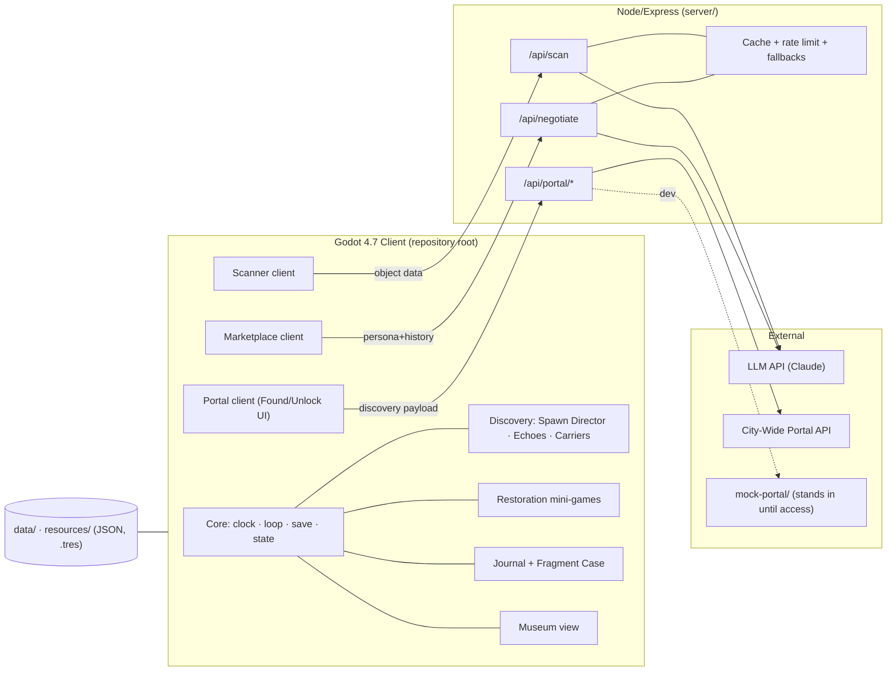
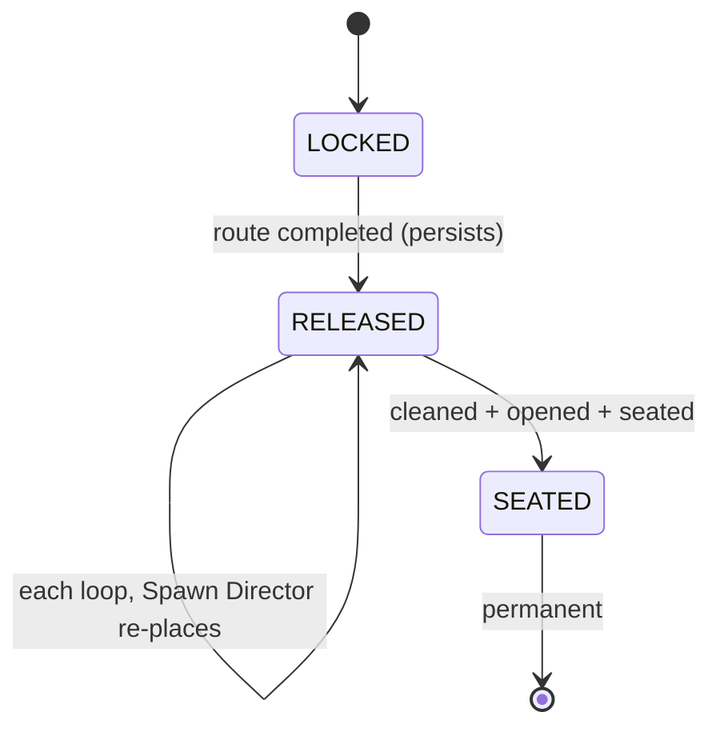
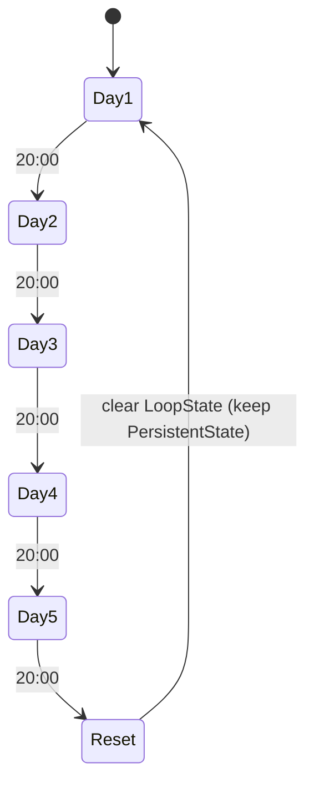
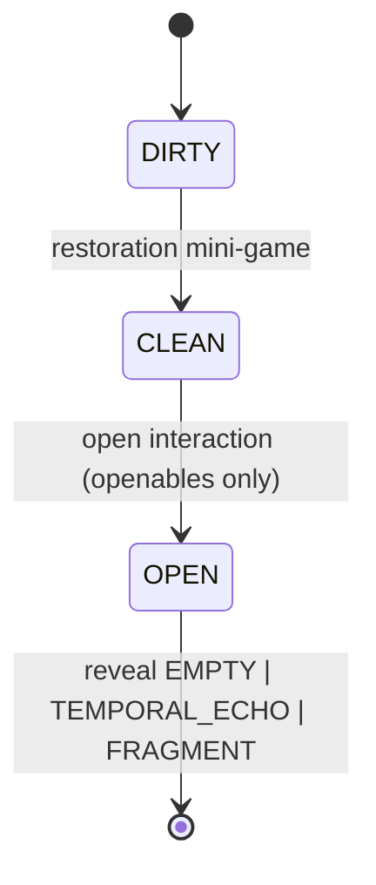
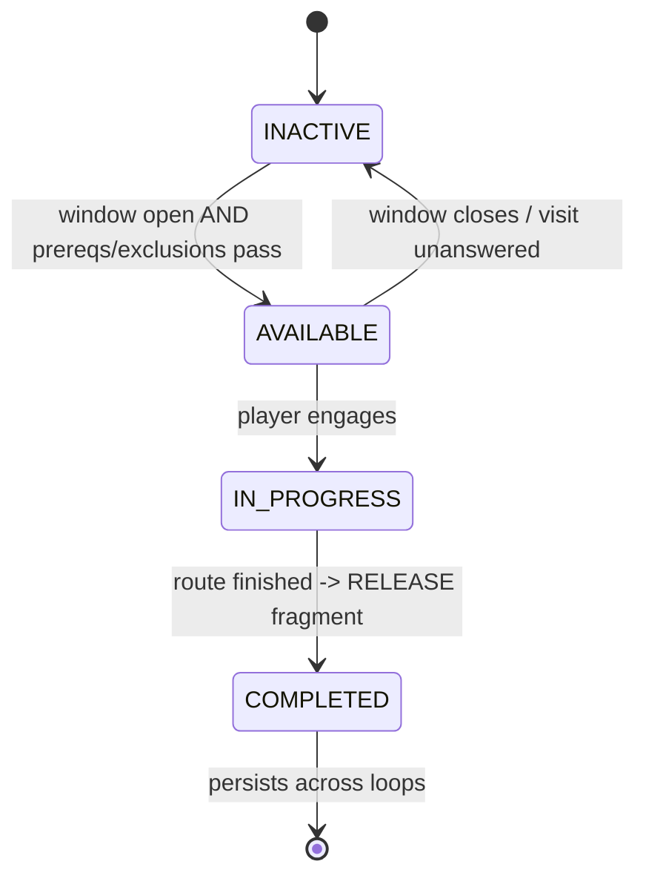

# PRD.md — aLima

**Product Requirements Document · the development reference for building *aLima*.**

| | |
|---|---|
| **Project** | aLima — cozy AI-powered historical-restoration roguelite |
| **Event** | AI Game On! · AI Fest 2026 · Iloilo City |
| **Stack** | Godot 4.7 (typed GDScript) · hybrid 3D shop + focused 3D restoration + hybrid 2D/3D journal + 2D interfaces (triage, scanner, dialogue, Portal) · Node/Express backend · JSON/`.tres` data |
| **Companion docs** | `CLAUDE.md` (operating spine + invariants) · `README.md` (GDD/design/narrative) · `docs/phase-task.md` (implementation order/status) |

> **How to use this doc.** This is the testable build contract. Every requirement has an **ID** (e.g. `SCAN-R3`) and must map back to a promise in the full-game GDD. Authority order is **`CLAUDE.md` §4 implementation invariants → `README.md` full-game product promises → this PRD's implementation detail → `docs/phase-task.md` execution and proof**. This PRD may clarify the GDD but may not silently omit or downgrade it. `P0` is the June 30 slice; `P1` is mandatory for 100% full-GDD completion; `P2` is optional post-release expansion. **Section 12 is the complete discovery specification** for the Spawn Director, Cultural Echoes, and carriers.

---

## Contents

1. Purpose & Scope
2. Goals & Milestone Scope (P0/P1/P2)
3. System Architecture
4. Data Models (canonical schemas)
5. Persistence & The Loop
6. Day Clock & Loop Controller
7. Delivery & Triage
8. Restoration (mini-games · tools vs techniques)
9. AI Object Scanner
10. AI Marketplace
11. The Journal
12. Discovery Subsystem (Spawn Director · Echoes · Carriers)
13. Portal Integration & Found/Unlock Flow
14. Digital Museum
15. Character Routes & Scheduling
16. Temporal Echoes
17. Mini-Events
18. The Safe & Locked Drawer
19. Endings & the Perfect Loop
20. Backend API Reference
21. State Machines
22. Build Sequencing & Definition of Done
23. Open Decisions
24. Disposition & Object Outcomes
25. Evening Upkeep & Preparation
26. Full-Game Content Contract
27. Input & Accessibility
28. Platforms, Offline Operation & Performance
29. Production Assets & Cultural Review
30. Full-Game QA, Release & Submission
31. GDD-to-Requirement Coverage

---

## 1. Purpose & Scope

aLima is a single-player game where the player runs a junk shop across a repeating **five-day loop**, rescuing and restoring discarded objects, authenticating them with an AI scanner, selling or preserving them, and — across loops — recovering the **five fragments** of a regional heritage artifact (the "Master Artifact") to break the loop.

**In scope for this PRD:** all runtime systems, data contracts, backend services, authored-content minimums, production-asset gates, cultural/provenance review, platform/input requirements, release evidence, and the build sequence from the June 30 slice through the finished GDD game.
**Stored outside this PRD:** narrative prose/dialogue, historical source packets, and binary art/audio assets live in `data/`, `assets/`, and production files. Their required quantity, review, integration, and acceptance remain in scope here. The final Master Artifact selection is a required pre-content decision (§23 / `CONTENT-R1`).

---

## 2. Goals & Milestone Scope

### 2.1 Product goals
- **G1.** Discovery flows *through* restoration — the player cleans and opens objects to find fragments, never bypasses it.
- **G2.** Progression is **knowledge, not resources** — the loop wipes money/stock; understanding persists.
- **G3.** **AI assists, the player judges** — the scanner suggests; the player decides.
- **G4.** Every required jam mechanic is real and demonstrable (procedural placement, Cultural Echoes, Portal Unlock, Digital Museum).
- **G5.** Stays **artifact-agnostic** until the artifact is locked.

### 2.2 Priority legend
| Tag | Meaning |
|---|---|
| **P0** | Required for the **June 30 vertical slice** (50% video) |
| **P1** | Required for **100% full-GDD completion** and the finished release |
| **P2** | Optional post-release expansion not promised by the current GDD |

### 2.3 Slice (P0) summary
One hybrid 3D shop space (restoration is a focused 3D object-manipulation view; the journal is hybrid 2D/3D; triage/scanner/dialogue/Portal are 2D); delivery + triage; **one** fully-built carrier (the pendant) with a 3D clean→open; Spawn Director v1 (genuine carrier+container+day rolls, per-player never-twice); Echo mixer v1 (4 bands + resonance meter + captions); cached scanner v1; Artifact Found → mock Portal → Portal Unlock → persisted museum record → journal seat (5-slot case, one slot fills); journal v1; the Elderly-Auntie photo beat as a scripted emotional showcase. Everything promised elsewhere in the GDD remains mandatory P1 work after the slice unless explicitly identified as post-release P2.

---

## 3. System Architecture



**Architecture requirements**
- **ARCH-R1 (P0).** All LLM/Portal calls go through the backend. The client never holds an API key. *(Invariant — CLAUDE.md §4-K.)*
- **ARCH-R2 (P0).** Backend wraps every external call with a timeout and a **cached fallback** response, so the client degrades gracefully and the exhibit build never depends on venue internet.
- **ARCH-R3 (P0).** Portal calls target a config-selected base URL: `mock-portal` in dev, real Portal in prod. Swapping is a single env/config change. *(Invariant §4-K / §13.)*
- **ARCH-R4 (P0).** Client↔system communication is via **signals/events**, not hard cross-references, so systems are independently testable. *(Convention — CLAUDE.md §7.)*
- **ARCH-R5 (P0).** All object/fragment/route/echo definitions load from `data/` or `resources/`. No hardcoded artifact specifics anywhere in logic. *(Invariant §4 / G5.)*
- **ARCH-R6 (P1).** Full-game integrations extend the typed event surface rather than coupling UI to services. At minimum it carries disposition selected/completed, sale completed, object returned, evening started/committed, mini-event started/resolved, route beat completed, and ending triggered events.

**Shop shell & diegetic interaction**
- **SHELL-R1 (P1).** The major shop actions are **diegetic 3D interactables** in the shop scene — at minimum the door, restoration workbench, journal, phone, and morning-delivery pile are physical props the player hovers (prompt + highlight) and clicks/confirms, rather than abstract HUD buttons. A reusable `Interactable3D` component owns hover/highlight/activation and emits an `activated` signal; the `ShopController` connects it to the existing action handler, so the diegetic prop and any fallback button trigger identical behavior. Interactables expose hover and pressed states; keyboard/controller/touch parity is provided by the labelled fallback controls (3D nodes cannot hold Control focus). Props are disabled while a full-screen overlay is open so input cannot fall through. *(Presentation contract; CLAUDE.md §0 / §4-N.)*
- **SHELL-R2 (P1, dev).** HUD action buttons may remain as **clearly-labelled accessibility/fallback/debug** controls during development, but the production direction is physical 3D interaction with clear prompts. A flat-button-only shop does not satisfy SHELL-R1. Final art and in-frame composition of the props are a production/manual gate (§29); placeholder dev geometry is acceptable in the interim if disclosed.
- **SHELL-R3 (P1).** The game presents **two connected spaces**: a **seated shop interior** (the existing diegetic-prop scene) entered through the front door, and a **walkable 3D scrapyard** stepped into through that same door, where the player roams on foot to forage rarity-tiered scrap, hand chosen scrap to Ayla (who sorts it into the day's delivery, §7), and track hidden fragment carriers by Cultural Echo proximity (§12). The clock runs in both; the door transitions between them and only one space is active/loaded at a time. Walking uses Input Map movement actions with mouse/controller/touch parity (§27) and must hold the performance targets in both spaces (§28).

**Full-game event contract**

```gdscript
signal disposition_completed(instance_id: String, disposition: String, outcome_id: String)
signal sale_completed(instance_id: String, buyer_id: String, price: int)
signal object_returned(instance_id: String, owner_route_id: String, reward_id: String)
signal evening_started(day: int)
signal evening_plan_committed(day: int, plan_id: String)
signal mini_event_started(event_id: String)
signal mini_event_resolved(event_id: String, outcome_id: String)
signal route_beat_completed(route_id: String, beat_id: String)
signal ending_triggered(ending_id: String)
```

---

## 4. Data Models

These are the **canonical schemas**. This section is the contract everything else builds on. GDScript shown; persisted data may serialize to JSON. Fields marked *(persist)* survive loop resets (see §5).

### 4.1 ScrapObjectTemplate — authored definition (`data/objects/*.json`)
```gdscript
class ScrapObjectTemplate:
    var id: String                       # "pocket_watch", "tarnished_pendant"
    var display_name: String
    var category: String                 # "jewelry" | "paper" | "mechanical" | "ceramic" | ...
    var base_rarity: Rarity              # WHITE..GOLD (apparent glow; can mislead)
    var weight_range: Vector2            # grams, for authenticity checks
    var materials: Array[String]
    var is_openable: bool
    var openable_type: String            # "" if not openable; else "pendant"|"tin"|"santo"|"frame"|...
    var required_clean_tool: String      # tool id needed to clean
    var clean_minigame: String           # which mini-game (REST §8)
    var base_value_range: Vector2        # pesos, honest market value
    var counterfeit_profile: String      # ref to a CounterfeitProfile id, or ""
    var historical_fact_ref: String      # ref for scanner/museum context, or ""
    var can_hold_temporal_echo: bool
```

### 4.2 ObjectInstance — runtime (one per delivered item, loop-scoped)
```gdscript
class ObjectInstance:
    var template_id: String
    var uid: String                      # unique this loop
    var condition: int = 0               # 0..100, raised by restoration
    var state: ObjState                  # DIRTY | CLEAN | OPEN
    var is_carrier: bool = false         # set by Spawn Director (DISC)
    var fragment_id: String = ""         # payload if carrier
    var contents: Contents = EMPTY        # EMPTY | TEMPORAL_ECHO | FRAGMENT
    var authenticity: Authenticity        # UNKNOWN | AUTHENTIC | REPLICA | MODIFIED | UNCERTAIN
    var is_counterfeit_truth: bool        # ground truth (player must discover)
```

### 4.3 Fragment *(persist)*
```gdscript
class Fragment:
    var id: String                       # "frag_1".."frag_5"
    var master_artifact_id: String
    var owning_character_id: String      # who holds/releases it
    var case_slot_index: int             # 0..4 in the journal case
    var state: FragmentState             # LOCKED | RELEASED | SEATED
    var echo_set_ref: String             # which EchoSet guides to it
    var historical_fact_ref: String      # unlocked fact on discovery
```

### 4.4 MasterArtifact — artifact-agnostic definition
```gdscript
class MasterArtifact:
    var id: String
    var display_name: String             # placeholder until locked (§23)
    var fragment_ids: Array[String]      # exactly 5
    var assembled_history_ref: String
```

### 4.5 CharacterRoute
```gdscript
class CharacterRoute:
    var id: String                       # "auntie","artisan","scavenger","archeologist","buyer","yuyu"
    var display_name: String
    var schedule: Array[VisitWindow]     # day + start/end hour
    var prerequisites: Array[String]     # route ids / flags required
    var mutual_exclusions: Array[String] # route ids that cannot co-occur this loop
    var holds_fragment_id: String        # "" for yuyu (finale)
    var rewards: Array[String]           # reward ids
    var has_ending: bool                 # buyer=false, yuyu=finale

class VisitWindow:
    var days: Array[int]                 # e.g. [1,3,5]
    var start_hour: int                  # 24h
    var end_hour: int
```

### 4.6 EchoSet *(per fragment)*
```gdscript
class EchoSet:
    var id: String
    var hum_stream: String               # asset ref
    var melody_stream: String
    var voice_stream: String             # Kinaray-a phrase audio
    var voice_caption: String            # subtitle + translation
    var heartbeat_stream: String
```

### 4.7 JournalEntry *(persist)* — Purple-and-below archive
```gdscript
class JournalEntry:
    var template_id: String
    var origin: String
    var materials: Array[String]
    var weight_range: Vector2
    var clean_method: String
    var counterfeit_indicators: Array[String]
    var historical_context: String
    var value_range: Vector2
    var best_condition: int              # highest achieved
    var best_sale: int                   # highest price recorded
    var variants_found: Array[String]
    var uncle_notes: String
    var ai_annotations: String
    var temporal_echoes_unlocked: Array[String]
```

### 4.8 MuseumEntry *(persist)* — Gold + Master Artifact archive
```gdscript
class MuseumEntry:
    var artifact_id: String
    var fact_card: String
    var photo_ref: String
    var timeline_entry: String
    var regional_story: String
    var character_memory_refs: Array[String]
```

### 4.9 Tool vs Technique *(Technique persists; shop-bought Tool does not; legacy Tool persists)*
```gdscript
class Technique:                          # PERSIST — knowledge of how
    var id: String
    var enables_minigame: String
    var learned_from: String              # "shop" | character id

class ToolItem:
    var id: String
    var enables: Array[String]            # minigames/quality it unlocks
    var quality: int
    var cost: int
    var is_legacy: bool                   # true => PERSIST (route reward); false => loop-scoped
```
> **Rule (REST-R5):** a mini-game may require a learned **Technique** (persistent) AND an owned **Tool** (loop-scoped unless legacy). Next loop you still *know* the method but may need to re-buy the kit. *(See GDD 9.2 / persistence table.)*

### 4.10 BuyerPersona
```gdscript
class BuyerPersona:
    var id: String
    var display_name: String
    var motive: String
    var budget_range: Vector2i
    var preferred_categories: Array[String]
    var negotiation_style: String
    var route_id: String                 # "" unless tied to a route
    var fallback_response_set: String
```

### 4.11 CounterfeitProfile
```gdscript
class CounterfeitProfile:
    var id: String
    var template_id: String
    var wrong_weight_range: Vector2
    var modern_fasteners: Array[String]
    var artificial_wear_signs: Array[String]
    var engraving_errors: Array[String]
    var seller_history_clues: Array[String]
    var journal_evidence_refs: Array[String]
```

### 4.12 TemporalEchoDefinition
```gdscript
class TemporalEchoDefinition:
    var id: String
    var eligible_template_ids: Array[String]
    var memory_text_ref: String
    var audio_ref: String
    var caption: String
    var journal_page_id: String
    var related_route_ids: Array[String]
```

### 4.13 MiniEventDefinition
```gdscript
class MiniEventDefinition:
    var id: String
    var trigger_conditions: Dictionary
    var weight: float
    var per_loop_cap: int
    var prompt_ref: String
    var outcome_ids: Array[String]
    var affected_systems: Array[String]
```

### 4.14 RouteBeat
```gdscript
class RouteBeat:
    var id: String
    var route_id: String
    var sequence_index: int
    var prerequisites: Array[String]
    var required_object_tags: Array[String]
    var dialogue_ref: String
    var completion_flags: Array[String]
    var reward_ids: Array[String]
```

### 4.15 EveningPlan
```gdscript
class EveningPlan:
    var id: String
    var day: int
    var repair_tool_ids: Array[String]
    var purchase_tool_ids: Array[String]
    var storage_discard_ids: Array[String]
    var prepared_request_ids: Array[String]
    var reviewed_journal_entry_ids: Array[String]
```

### 4.16 ContentManifest
```gdscript
class ContentManifest:
    var schema_version: int
    var required_counts: Dictionary
    var required_ids: Dictionary
    var source_packet_refs: Array[String]
    var native_speaker_review_refs: Array[String]
    var provenance_refs: Array[String]
```

The manifest is validated in CI and at development startup. It records minimum counts and required named IDs without embedding prose or artifact-specific logic in gameplay code.

---

## 5. Persistence & The Loop  · P0

The single most consequential system. The save is split at the reset boundary.

```gdscript
class SaveState:
    var persistent: PersistentState      # survives every reset (Chronos-bound)
    var loop: LoopState                  # wiped on reset
```

| `PersistentState` *(survives)* | `LoopState` *(wiped on reset)* |
|---|---|
| `journal_entries` | `money` |
| `techniques_learned` | `inventory` (ordinary items) |
| `scanned_records` | `tool_items` (non-legacy) & temp upgrades |
| `museum_entries` | `marketplace_listings` |
| `story_clues`, `dialogue_flags` | `pending_requests` |
| `route_completion` flags | `day_event_outcomes` |
| `fragments` (incl. `SEATED` + case) | `current_day`, `current_hour` |
| `legacy_items`, `leads` | per-loop instance state |
| `spawn_history` (per-player, per-fragment) | |
| `route_beat_progress`, `returns_completed` | `disposition_queue`, `daily_sales` |
| `endings_unlocked`, `temporal_echoes` | `evening_plan`, `upkeep_state` |
| `content_version`, `source_review_version` | `active_event`, `events_seen_this_loop` |

**Requirements**
- **SAVE-R1 (P0).** On loop reset, clear `LoopState` only; `PersistentState` is untouched. *(Invariant §4-A.)*
- **SAVE-R2 (P0).** `fragments` seated into the case remain `SEATED` across resets and never re-spawn. *(Invariant §4-B.)*
- **SAVE-R3 (P0).** `spawn_history` is keyed `fragment_id → [(carrier_id, container_id)]` and persists, backing the never-twice guarantee. *(DISC.)*
- **SAVE-R4 (P1).** `route_completion` persists; a completed route stays completed and keeps its fragment `RELEASED` until found.
- **SAVE-R5 (P1).** Legacy tools (`is_legacy=true`) and `leads` persist; shop-bought tools do not.
- **SAVE-R6 (P0).** Saving is atomic (write-temp-then-rename) to survive a crash mid-write.
- **SAVE-R7 (P1).** Full-game saves persist route beats, returns, Echoes, endings, content/review versions, and long-term records while keeping daily sales, current dispositions, evening preparation, upkeep, and event state loop-scoped. Schema migrations preserve existing Phase 0/P1 saves.

**Acceptance**
- [ ] Reset wipes money/inventory/listings; journal, museum, techniques, seated fragments, spawn history all remain.
- [ ] A seated fragment never appears in a future delivery.
- [ ] Re-entering a loop with a known lead makes the gated content available earlier (§15).

---

## 6. Day Clock & Loop Controller  · P0

- **CLOCK-R1 (P0).** Time advances at **1 real minute = 1 in-game hour**. Shop day runs **07:00–20:00** (~13 real min); a five-day loop ≈ 1 hour.
- **CLOCK-R2 (P0).** The controller exposes `current_day (1..5)` and `current_hour`, and emits signals on hour change, day change, and loop reset.
- **CLOCK-R3 (P0).** At end of Day 5 → `loop_reset` → `SaveState` reset per §5 → Day 1, 07:00.
- **CLOCK-R4 (P1).** NPC visit windows are checked against the clock; a knock fires only inside a character's window (§15). The player may ignore a knock; an unanswered visitor leaves and that visit is consumed.
- **CLOCK-R5 (P1).** Full-screen interfaces use pause ownership by default so restoration, scanner, negotiation, journal, and evening planning do not consume shop time; any authored exception is explicit and tested.

**Acceptance**
- [ ] A full day elapses in ~13 real minutes; loop in ~1 hour.
- [ ] Reset returns to Day 1 07:00 with `LoopState` cleared.

---

## 7. Delivery & Triage  · P0

- **DLV-R1 (P0).** Each day's delivery is **earned by foraging**: the player gathers rarity-tiered **scrap** in the walkable scrapyard (SHELL-R3) and hands chosen scrap to Ayla, who sorts it into a set of `ObjectInstance`s. The sort is **weighted toward the scrap's own tier** with only a slim chance (~5%) of climbing one rarity higher (rarer-leaning; see D10), so high-rarity restorables stay scarce. Each handed-in scrap yields **1–3 outputs** when sorted, each independently a restorable object (rarity per D10), a **minor item**, or **trash** (worthless, auto-recycled) — so a batch can return thin or junk-heavy (D12). There is no free automatic morning drop. Fragment **carriers** for any `RELEASED` fragment are placed by the Spawn Director in the scrapyard (§12), not injected into this sorted delivery.
- **DLV-R2 (P0).** Storage, time, and money are limited; the player selects which objects to keep before the rest is bulk-recycled (discarded).
- **DLV-R3 (P0).** Each instance shows its **apparent** rarity glow per the fixed legend (§4.1 / Invariant §4-E). The glow reflects *appearance*, not truth — counterfeits can over-glow, treasures can under-glow.
- **DLV-R4 (P1).** Delivery composition responds to mini-events (§17) (e.g., Rush Delivery = larger batch, less time).
- **DLV-R5 (P0).** Pile size stays within the tuned cap (§23 open decision) so "right pile + heartbeat" lands fast, not as a slog.

**Acceptance**
- [ ] Player can keep N and recycle the rest under a storage cap.
- [ ] A Spawn-Director carrier reliably appears at its assigned scrapyard hiding spot on the correct day.

---

## 8. Restoration  · P0 (one mini-game) / P1 (full set)

- **REST-R1 (P0).** Restoration is a tactile **3D object-manipulation** mini-game raising an instance's `condition` (0→100). Object `state`: `DIRTY → CLEAN`. (See REST-R8 for the presentation contract.)
- **REST-R2 (P1).** Distinct mini-games per category: brushing, wiping, rust removal, polishing, paper care, frame repair, photo restoration, engraving reveal, mechanism inspection. Each is a 3D interaction on the object's surface (REST-R8).
- **REST-R3 (P0).** Using the **wrong tool** can erase detail / lower condition / permanently reduce value. Correct tool+technique improves outcome.
- **REST-R4 (P0).** A carrier must reach `CLEAN` before it can be opened. *(Invariant §4-D.)* Both cleaning and the type-specific open are 3D manipulations of the same object; the modality does not relax the gate.
- **REST-R5 (P1).** A mini-game may require a learned **Technique** (persistent) and an owned **Tool** (loop-scoped unless legacy) — §4.9.
- **REST-R6 (P1).** Some techniques are learnable only from characters (e.g., the Artisan), not the shop.
- **REST-R7 (P0, slice).** For the slice, build the **one** mini-game the pendant uses; ensure its tool is in the kit at slice start so the demo is always winnable.
- **REST-R8 (P0).** Restoration presents the object as a **manipulable 3D model in a focused restoration view**: the player orbits/rotates it and applies the selected tool **across its 3D surface** (grime/dirt is represented on the surface and cleared by working the tool over it; see D8), framed by a 2D background + HUD overlay carrying **supportive** condition/value meters, feedback, and captions. The 2D HUD supports the interaction (labels, meters, accessibility) but is not the primary tool chooser — tool selection happens in the 2D tool sidebar, after which the held tool's 3D model follows the cursor over the surface (see REST-R9). The clean→open gate (REST-R4), tool consequences (REST-R3), and tools-vs-techniques rules (REST-R5) are unchanged; only the presentation is 3D. The underlying restoration logic is presentation-agnostic and shared across input methods (INPUT-R5). The slice's pendant clean→clasp-open is built in this 3D view (REST-R7).
- **REST-R9 (P0).** The cleaning tools are chosen from a **2D left-edge tool sidebar** — up to eight numbered rows (the bench loadout cap is 8), one per equipped tool, built data-driven from the owned `ToolDefinition`s (artifact-agnostic). Each row shows a **rotating 3D model** of the tool, the **surface conditions it cleans** (each with its cleaning-power number, from `CleaningPower`), and a **durability bar**. The player selects a tool by clicking its row or pressing its number key (1–8); the selected row is visibly distinguished and the **tool's 3D model follows the cursor** so it reads as "in hand," keeping the surface-cleaning itself a tactile 3D act. Selection drives the same `RestorationService` path as before — the sidebar is presentation only and never reads carrier identity. The HUD's flat tool buttons remain only as a **clearly-labelled accessibility/fallback** path; the production interaction must not require clicking a flat text "Cloth" button. *(Superseded direction: tools were formerly selectable 3D props standing on the bench; that 3D tray is retained hidden behind the sidebar for compatibility.)*

**Acceptance**
- [ ] Cleaning raises condition and gates opening.
- [ ] Wrong-tool use is punished (value/condition loss) and recorded.
- [ ] Restoration runs in the focused 3D view: the object can be rotated and is cleaned across its surface; the clean→open gate and tool consequences behave identically to the underlying logic.
- [ ] Tool choice is made from the 2D tool sidebar — numbered rows with a rotating 3D model, the conditions each cleans (with power) and a durability bar; click or number key 1–8 selects, and the held tool follows the cursor (REST-R9). The HUD tool buttons are a labelled accessibility/fallback, not the primary control.

---

## 9. AI Object Scanner  · P0 (cached) / P1 (live)

- **SCAN-R1 (P0).** After cleaning, the player scans an object. The scanner returns **suggestions**: object type, possible period, detected materials, visible markings, condition, cultural relevance, suggested price range, and signs of modification/counterfeiting.
- **SCAN-R2 (P0).** The scanner **never** sets `authenticity` itself. It surfaces evidence; the player sets the verdict (`AUTHENTIC | REPLICA | MODIFIED | UNCERTAIN`). *(Invariant §4-G.)*
- **SCAN-R3 (P1).** For suspicious items, scanner output is cross-referenced against the journal: a counterfeit may betray itself via wrong weight, modern fasteners, artificial wear, poorly copied engravings, suspicious seller history (`CounterfeitProfile`).
- **SCAN-R4 (P0).** Scanner calls go through `POST /api/scan` (backend, §20); the client never calls the LLM directly. *(Invariant §4-K.)*
- **SCAN-R5 (P0).** The slice ships **cached** scanner annotations for slice objects; live LLM is P1.
- **SCAN-R6 (P1).** Scanner facts derive only from verified records; legend is framed as legend. *(Invariant §4-L.)*
- **SCAN-R7 (P1).** The finished build passes both live backend scanner scenarios and forced timeout/rate-limit/offline fallback scenarios. Cache-only operation does not satisfy full-game completion.

**Acceptance**
- [ ] Scanner output is advisory; the player must choose the verdict.
- [ ] A counterfeit is solvable by comparing scan vs journal — never auto-flagged.

---

## 10. AI Marketplace  · P1

- **MKT-R1 (P1).** The player lists restored items; buyers respond via an AI-driven chat with distinct personas, budgets, and motives (collector, aggressive reseller, budget student, sentimental gift buyer, condition hobbyist, **suspicious buyer** asking about a certain symbol).
- **MKT-R2 (P1).** The player can accept, reject, or haggle/banter; accurate descriptions and honest restoration raise achievable price.
- **MKT-R3 (P1).** Negotiation runs through `POST /api/negotiate` (backend) with **persona + guardrail prompts server-side**. *(Invariant §4-K.)*
- **MKT-R4 (P1).** Selling is the primary economy, but some objects (Gold / Master-Artifact-linked) should be preserved, not sold — the UI nudges this.
- **MKT-R5 (P1).** Best sale price per template updates the journal (`best_sale`).
- **MKT-R6 (P1).** The suspicious buyer ties into the Mysterious-Buyer route (§15) — repeated dealings build toward the fifth fragment.
- **MKT-R7 (P1).** All six personas work through live `POST /api/negotiate` and deterministic offline fallback response sets; both paths preserve persona, budget, restoration-quality, and honesty constraints.

**Acceptance**
- [ ] At least the listed personas produce distinct, in-character offers.
- [ ] Haggle outcomes reflect restoration quality and description accuracy.

---

## 11. The Journal  · P0

- **JRN-R1 (P0).** The journal is the persistent archive + progression system. Every restored object earns/updates a `JournalEntry` (§4.7).
- **JRN-R2 (P0).** The journal's first page holds the **five-slot Fragment Case**; the player seats each fragment as recovered. Seated fragments persist (§5). *(Invariant §4-B / §4-A.)*
- **JRN-R3 (P0).** **Purple-and-below** finds are archived in the journal; **Gold + Master Artifact** go to the museum (§14). *(Invariant §4-F.)*
- **JRN-R4 (P1).** Mystery pages (Master-Artifact sketches, faded symbols, references to the five) become legible as routes complete and Temporal Echoes are unlocked (§16).
- **JRN-R5 (P0).** AI annotations on entries come from the scanner/backend (verified records), clearly distinguished from the uncle's handwritten notes.
- **JRN-R6 (P0/P1).** The journal is presented as a **hybrid 2D/3D** interface: the book, pages, notes, and annotations are a 2D paper UI, while the Fragment Case renders seated fragments (and the assembling Master Artifact) as rotatable **3D viewers**, and object entries may embed a 3D preview of the restored object. The archive routing (JRN-R3), persistence (§5), and entry/seating data contracts are unchanged by the presentation. (P0: the 5-slot case with at least the seated-fragment 3D viewer; richer per-entry 3D previews are P1.)

**Acceptance**
- [ ] Restoring an object creates/updates its entry with condition/sale records.
- [ ] Seating a fragment fills a case slot that persists across resets.
- [ ] The Fragment Case shows seated fragments as 3D viewers within the 2D journal; archive routing and persistence are unaffected.

---

## 12. Discovery Subsystem  · P0

> This section is the complete discovery specification. **Carrier is a role, not an object type** (§4-C); echoes guide, heartbeat disambiguates; clean→open gate applies.

### 12.1 Spawn Director
- **DISC-R1 (P0).** At loop start, for each `RELEASED` fragment, output a placement `{carrier_instance, scrapyard_location (and/or outer_container), day}`. The carrier hides in the walkable scrapyard and the player tracks it by Cultural Echo proximity (DISC-R7). (Location/container → carrier → fragment; the fragment is always nested in a carrier, never loose.)
- **DISC-R2 (P0).** **Promote** an ordinary openable instance to carrier (set `is_carrier`, `fragment_id`); do not spawn a special object. *(Invariant §4-C.)*
- **DISC-R3 (P0).** **Never-twice:** exclude any `(carrier, container)` pair in `spawn_history[fragment]`; soft-reset (forbidding only the most-recent pair) if exhausted, to avoid deadlock. *(SAVE-R3.)*
- **DISC-R4 (P0).** **Winnable:** never place a fragment behind a tool the player can't obtain that run (hard filter). *(Invariant §4-H.)*
- **DISC-R5 (P0).** **Container compatibility** is a hard filter; **neglect weighting** biases toward containers the player ignores; **day-spread** bonus varies the day. The Safe becomes an eligible outer container only after its code is known; even then, it contains a promoted ordinary carrier and never a loose fragment.
- **DISC-R6 (P0).** Placement draws weighted-random against a per-run seed; log `(seed → placements)` for the demo.

### 12.2 Cultural Echoes
- **DISC-R7 (P0).** Four bands mixed by a `proximity` scalar 0–1: Hum (0–.30) → Melody (.30–.60) → Voice (.60–.85) → Heartbeat (.85–1.0), additive with crossfades.
- **DISC-R8 (P0).** Echoes run **only** when a `RELEASED`, unfound carrier is in the current scene; silence otherwise. *(Invariant §4-I.)*
- **DISC-R9 (P0).** The **Heartbeat band is gated to `is_carrier == true`** — physically impossible on a decoy. It is the disambiguator. *(Invariant §4-E / §4-I.)*
- **DISC-R10 (P0).** Carrier **flicker** (reusing the existing `flickering` glow) only becomes visible at proximity ≥ `GLOW_REVEAL_AT` (0.60) so audio leads, glow confirms. *(Invariant §4-E.)*
- **DISC-R11 (P0).** A **resonance meter** UI mirrors `proximity`; each band has **subtitle captions**; the carrier and meter pulse with the heartbeat — fully playable and demo-legible without audio.

### 12.3 Carriers / openables
- **DISC-R12 (P0).** Opening is a general feature: opening any openable yields `EMPTY | TEMPORAL_ECHO | FRAGMENT`. Only Director-placed carriers yield `FRAGMENT`.
- **DISC-R13 (P0).** Open interaction is type-specific (clasp/pry/unscrew/slide). Build **one** (pendant clasp) for the slice; pool the rest (P1).
- **DISC-R14 (P1).** The full game provides at least 15 openable carrier candidates and at least 3 compatible candidates for every fragment after tool, container, and route filters. Every authored openable type has a tested opening interaction.
- **DISC-R15 (P1).** Every fragment has its own reviewed `EchoSet`, captions, proximity tuning, carrier anchors, and deterministic QA placement scenarios.

**Acceptance (slice-critical)**
- [ ] Three runs of the same fragment yield visibly different carrier + container + day; never a repeat pair for that player.
- [ ] Following the echoes leads to the exact carrier; the heartbeat never fires on a non-carrier.
- [ ] Clean→open→fragment works end-to-end on the pendant.

---

## 13. Portal Integration & Found/Unlock Flow  · P0 (mock) / P1 (live)

- **PORT-R1 (P0).** On opening a carrier and revealing a fragment, show the **Artifact Found** screen: item render, name, origin, condition, fragment count (n/5).
- **PORT-R2 (P0).** The Found screen triggers `POST /api/portal/discovery` with `{artifact_id, fragment_id, player_id, timestamp, condition, discovery_context}`.
- **PORT-R3 (P0).** On response, show the **Portal Unlock** notification with the real-world historical fact, persist the P0 museum record (§14), and seat the fragment (§11). The polished online/in-game gallery remains P1.
- **PORT-R4 (P0).** In dev, the request hits `mock-portal/`, which mirrors the real contract 1:1. Prod swap is config-only. *(ARCH-R3.)*
- **PORT-R5 (P0).** If the call fails/times out, the backend returns a cached fallback fact so the flow always completes. *(ARCH-R2.)*
- **PORT-R6 (P1).** Before full-game completion, a configured live Portal endpoint must pass discovery, idempotency, museum retrieval, and failure-recovery tests. Mock Portal remains the deterministic CI/dev target, not the sole finished integration.

**Acceptance**
- [ ] Found → API call → Unlock fact → persisted museum record → fragment seated, on camera, against the mock.
- [ ] Pointing config at a live Portal requires no code change.

---

## 14. Digital Museum  · P0 record / P1 gallery

- **MUS-R1 (P1).** The polished online API museum displays **Gold** finds and the **Master Artifact** with fact cards, photos, timelines, regional stories, and character memories (`MuseumEntry`, §4.8). *(Invariant §4-F.)*
- **MUS-R2 (P0 record / P1 gallery).** Each verified discovery posts to the Portal and persists a `MuseumEntry` record in P0; displaying it in the player's polished gallery/profile is P1.
- **MUS-R3 (P1).** The museum view in-game mirrors the portal gallery and remains available in offline/fallback mode from persisted records.
- **MUS-R4 (P1).** Museum facts derive only from verified records; folklore framed as folklore. *(Invariant §4-L.)*

**Acceptance**
- [ ] A Gold find and a seated fragment both produce museum entries.
- [ ] Purple-and-below items do **not** enter the museum (journal only).

---

## 15. Character Routes & Scheduling  · P1

Five fragment-holders (Auntie, Artisan, Scavenger, Archeologist, Buyer); the uncle (Yuyu) is the finale, not a holder. Schedules and gates below are authoritative.

| Route | ID | Window(s) | Gate | Holds | Reward |
|---|---|---|---|---|---|
| Elderly Auntie (Shine) | `auntie` | 12:00–14:00 on Days 1,3,5 | — | frag | Safe code · drawer clue |
| Local Artisan (Lave) | `artisan` | 13:00–14:00 on Days 2,4,5 | **Auntie helped** (her grandson; no longer excludes Ayla) | frag | delicate (legacy) tool · fragile-object access |
| Trash Scavenger (Ayla) | `scavenger` | present in the scrapyard every open day (delivery NPC) | **Sam's excavation tool** to dig the lunchbox (ROUTE-R8); the Archeologist lead is free from daily contact | frag | frag released |
| Archeologist (Sam) | `archeologist` | 15:00–17:00 Day 1; 08:00–11:00 Days 3,5 | **Ayla's lead** (from daily contact, persists; so available from Day 1 on later loops) | frag | excavation tools (also unearth Ayla's lunchbox) · sturdy-object access |
| Mysterious Buyer (Mr. Maverick) | `buyer` | daily 17:00–18:00 (+ 07:00–09:00 Day 5) | deal on Days 1–4 ≥ once; **finale capstone, after the other four are seated** | releases frag (5th) | guaranteed special carrier in the yard · encoded ledger · investigation evidence |
| Uncle's Legacy (Yuyu) | `yuyu` | — | all 5 fragments seated | — (finale) | Master Artifact whole · Perfect Loop |

**Requirements**
- **ROUTE-R1 (P1).** A route is offered only inside its window AND when prerequisites/exclusions pass, evaluated **at window-open time**.
- **ROUTE-R2 (P1).** **Ayla is the permanent scrapyard delivery NPC, not a gated visitor.** She is present every open day, sorts foraged scrap into the delivery (§7), and her route advances through daily hand-offs and milestone beats (notably foraging her late father's lunchbox) independent of the Auntie. The **Artisan** is unlocked when the Auntie is helped (he is her grandson) and offered in his Days 2/4/5 window; he no longer replaces or excludes Ayla. Both fragment-holders can be pursued in one loop. *(Supersedes the former same-slot mutual exclusion; see `docs/route-dialogue-compendium.md`.)*
- **ROUTE-R3 (P1).** Completing a route **releases** its fragment (`LOCKED→RELEASED`) into the scrap stream (§12), with in-fiction justification — never handed directly. *(Invariant §4-B / §12.)*
- **ROUTE-R4 (P1).** Route completion + leads persist (§5); a known lead makes gated content available earlier on later loops (e.g., Archeologist from Day 1).
- **ROUTE-R5 (P1).** The Buyer has no ending; after qualifying deals, his Day 5 encounter deterministically releases the fifth fragment into a guaranteed special delivery. The Spawn Director still promotes an ordinary carrier and places it; the Buyer never hands over the fragment directly.
- **ROUTE-R6 (P1).** An unanswered visit within a window is consumed (CLOCK-R4) and may close that route for the loop.
- **ROUTE-R7 (P1).** **One route completion per loop.** A loop has room to complete at most one fragment-holder route — scheduled characters' windows conflict, and Ayla's completion has its own multi-step gate (ROUTE-R8). Finding/seating an already-`RELEASED` fragment in the scrapyard is a parallel yard activity and does **not** count against this. Re-running a completed route in a later loop replays scenes but releases no new fragment.
- **ROUTE-R8 (P1).** **Ayla's cross-route completion gate.** Ayla is the permanent scrapyard delivery NPC; her **Archeologist lead** is earned early from daily contact (not from completing her). Her own completion is gated behind **Sam's excavation tool**: with it the player digs her father's lunchbox from the yard, restores it (initials reveal), and selects a "Show Ayla the lunchbox" interaction to finish the route and release her fragment. This decouples the former Ayla→Sam→Ayla dependency cycle (lead from contact; fragment from the tool + lunchbox).

**Acceptance**
- [ ] Ayla is present in the scrapyard every open day and sorts foraged scrap into the delivery regardless of the Auntie's state.
- [ ] Helping the Auntie unlocks the Artisan in his Days 2/4/5 window; he does not remove Ayla.
- [ ] Both the Artisan's and the Scavenger's fragments can be released within a single loop.

---

## 16. Temporal Echoes  · P1

> Distinct from Cultural Echoes (§12). A Temporal Echo is a **memory inside an everyday object**, released by restoring/opening it.

- **TEMP-R1 (P1).** Successfully restoring/opening an eligible object may release a Temporal Echo: a short memory of a past owner.
- **TEMP-R2 (P1).** Each released Echo clears static from a journal page, surfacing fresh ink (the uncle reconstructing his past). *(JRN-R4.)*
- **TEMP-R3 (P1).** Some Echoes reference the five fragment-holders, threading ordinary restoration into the central mystery.
- **TEMP-R4 (P1).** Released Echoes are recorded in the journal and **persist** (§5).

**Acceptance**
- [ ] Restoring an Echo-bearing object unlocks a memory and clears a journal page.

---

## 17. Mini-Events  · P1

- **EVT-R1 (P1).** All eight scripted/random events vary runs without distracting from the core loop: **Rush Delivery, Sudden Brownout, Community Request, Suspicious Antique, Rare Buyer Alert, Mystery Box, Rainy-Day Leak, Tool Breakdown.**
- **EVT-R2 (P1).** Each event has clear trigger conditions, a player-facing prompt, and a bounded outcome that feeds existing systems (delivery, restoration, marketplace).
- **EVT-R3 (P1).** Event frequency is data-tunable and capped per loop to avoid noise; each named event must be reachable in deterministic QA scenarios.

**Acceptance**
- [ ] All eight named events function, are individually testable, and affect at least one existing system.

---

## 18. The Safe & Locked Drawer  · P1

- **CACHE-R1 (P1).** Completing the Auntie route reveals the **Safe code**. Because money resets, the payoff lands in a later loop: once known, the player can open the Safe anytime for **₱1,000**. Knowing the code also makes the Safe eligible as a Spawn Director outer container; if selected, it contains a promoted ordinary carrier, never a loose fragment.
- **CACHE-R2 (P1).** The locked **drawer** is a second gated cache (same route's clue) holding journal pages + investigation notes.
- **CACHE-R3 (P1).** Safe code and drawer access persist (§5) once revealed.

**Acceptance**
- [ ] After learning the code, the Safe opens in a later loop and pays out.

---

## 19. Endings & the Perfect Loop  · P1

- **END-R1 (P1).** Five endings: four character endings (Auntie, Artisan, Scavenger, Archeologist) each completed by finishing that route; plus the **Yuyu** finale. The Buyer has no ending (supplies the 5th fragment).
- **END-R2 (P1).** Completing no routes → **Neutral**: the loop simply repeats.
- **END-R3 (P1).** The **Perfect Loop (Yuyu)** requires all five fragments seated. Because fragments persist, this is *the loop in which the final fragment is seated* — not a forced same-cycle re-gather. *(Resolves the former GDD 9.6-vs-9.14 conflict.)*
- **END-R4 (P1).** With one route completion per loop (ROUTE-R7), the five fragments are gathered across **several loops** (≈5), not one: each loop complete one character (Auntie; Artisan after Auntie; Archeologist; Scavenger after the Archeologist per ROUTE-R8) and release their fragment, seating released fragments in the scrapyard over the following loops; deal with the Buyer at least once along the way; then in the final loop, with the other four seated, the Buyer's qualifying Day-5 encounter releases the 5th into a Director-placed yard carrier → find/clean/open → seat → case full → loop releases → uncle returns.
- **END-R5 (P1).** When the case fills, trigger the finale: assemble/restore the Master Artifact, resolve the uncle's thread, end the loop.

**Acceptance**
- [ ] Seating the fifth fragment triggers the Yuyu finale and ends the loop.
- [ ] Each character ending is reachable by completing its route.

---

## 20. Backend API Reference  · P0 (scan, portal) / P1 (negotiate)

All endpoints are backend-only; the client never calls the LLM/Portal directly. All wrap timeout + cached fallback (ARCH-R2).

### `POST /api/scan`  *(P0, cached → P1 live)*
```jsonc
// req
{ "instance": { "template_id": "...", "materials": [...], "markings": [...],
                "condition": 0-100, "weight": 0.0 } }
// res — SUGGESTIONS ONLY, never a verdict
{ "type": "...", "period": "...", "materials": [...], "markings": [...],
  "condition_note": "...", "cultural_relevance": "...",
  "price_range": [min, max], "modification_signs": [...] }
```

### `POST /api/negotiate`  *(P1)*
```jsonc
// req
{ "buyer_persona": "collector|reseller|student|gift|hobbyist|suspicious",
  "object": { "template_id": "...", "condition": 0-100, "description": "..." },
  "listing_price": 0, "history": [ { "role": "...", "text": "..." } ],
  "player_message": "..." }
// res
{ "buyer_message": "...", "offer": 0, "walked_away": false }
```

### `POST /api/portal/discovery`  *(P0 vs mock → P1 live)*
```jsonc
// req
{ "artifact_id": "...", "fragment_id": "...", "player_id": "...",
  "timestamp": "ISO-8601", "condition": 0-100, "discovery_context": "..." }
// res  (mock mirrors this 1:1)
{ "fact_card": "...", "artifact_meta": { "name": "...", "period": "..." },
  "museum_entry_id": "...", "fragment_index": 1 }
```

**Requirements**
- **API-R1 (P0).** Keys/secrets only in `server/.env` (never committed; `.env.example` provided).
- **API-R2 (P0).** Rate-limit LLM endpoints; serve cached fallbacks on limit/timeout.
- **API-R3 (P0).** `/api/portal/discovery` base URL is config-selected (mock vs live).

---

## 21. State Machines

**Fragment lifecycle**


**Day / loop**


**Object interaction**


**Route**


---

## 22. Build Sequencing & Definition of Done

### 22.1 Order (P0 — to June 30)
1. **Core:** day clock + loop controller + split save (§5,§6). *DoD: reset keeps/wipes correctly.*
2. **Delivery/triage** (§7) + object data pipeline (§4.1–4.2). *DoD: keep/recycle works; glow shows.*
3. **Restoration (pendant mini-game — focused 3D view)** (§8 REST-R7/REST-R8) + clean→open gate. *DoD: cleaning gates opening, performed by rotating/cleaning the 3D object.*
4. **Carriers/openables** (§12.3) — pendant clasp + `EMPTY|TEMPORAL_ECHO|FRAGMENT`. *DoD: opening yields contents.*
5. **Spawn Director v1** (§12.1) — genuine rolls + never-twice. *DoD: 3 runs differ, no repeat pair.*
6. **Echo mixer v1** (§12.2) — 4 bands + resonance meter + captions. *DoD: echoes lead to carrier; heartbeat carrier-only.*
7. **Cached scanner v1** (§9; SCAN-R1, R2, R4, R5). *DoD: evidence is advisory and the player sets the verdict.*
8. **Found → mock Portal → Unlock → persisted museum record → seat** (§13) + journal v1 + 5-slot case (§11). *DoD: full beat on camera.*
9. **Record video** (3 beats, §12–13 acceptance) + finalize `docs/ai-disclosure.md`.

### 22.2 Full Game (P1 — mandatory for 100%)
`docs/phase-task.md` Phases 12–22 implement the complete GDD: artifact/content lock; full restoration catalog; economy, disposition, and evening upkeep; all routes; Temporal Echoes, journal, and museum; full discovery pools; all events; endings; final production assets and cultural review; live services and platform/input parity; then whole-game QA, 6–10 hour playtesting, exports, replica, lore video, and submission. This work is deferred from the slice, not optional.

### 22.3 Global Definition of Done
A task is done when: it satisfies its requirement IDs and mapped GDD promise; respects all `CLAUDE.md` §4 invariants; has focused automated tests where logic exists; passes lint/format/import; completes its manual gameplay, content, or production acceptance; records evidence in the phase tracker; updates AI disclosure when needed; and is committed with a Conventional Commit message.

Full-game completion additionally requires every P1 requirement, every content-manifest minimum, all production/cultural review gates, live-plus-fallback service tests, Windows/HTML5 and mouse/controller/touch completion, and `REL-R1..R8`. P2 work may remain incomplete because it is outside the current GDD promise.

---

## 23. Open Decisions (resolve before content build; non-blocking for slice)

| # | Decision | Default until decided |
|---|---|---|
| D1 | **Master Artifact** selection | Heirloom Timepiece (frontrunner); keep artifact-agnostic |
| D2 | **Carrier pool size** per fragment | 1 (pendant) for slice; at least 3 compatible candidates per fragment and 15 total for full game |
| D3 | **Decoy density** (ordinary flickering openables per loop) | enough that flicker ≠ fragment by sight |
| D4 | **Pile size cap** (openables per pile) | ≤ 6 |
| D5 | **Does cleaning/scanning consume in-game time?** (CLOCK-R5) | Full-screen UI pauses through pause ownership; authored exceptions must be explicit |
| D6 | **Locked-crate gating** for fragments vs reserved for Safe/drawer | fragments not behind solvable locks in slice |
| D7 | **Buyer 5th-fragment release** | deterministic special delivery once Perfect-Loop conditions are met (ROUTE-R5 / END-R4) |
| D8 | **3D dirt/cleaning representation** (REST-R8) | shader dirt-mask cleared by tool strokes (alternatives: decals / vertex paint); keep the restoration logic presentation-agnostic |
| D9 | **Restoration view framing** (REST-R8) | resolved: focused 3D restoration view (3D object + 2D background/HUD overlay) |
| D10 | **Scrap → delivery rarity bias** (DLV-R1) | rarer-leaning: the sort skews to the scrap's own tier, ~5% chance one tier up, ~35–40% one tier down (white floor ~95/5, gold ceiling ~65/35); full table below the decisions table; numbers tunable |
| D11 | **Scrapyard size, zoning & perf** (SHELL-R3) | compact, zoned outdoor lot loaded only while outside; sized so the echo gradient is a real walk yet holds 30 FPS on the web reference (PLAT-R4) |
| D12 | **Scrap yield (count + junk rate)** (DLV-R1) | each sorted scrap yields 1–3 outputs; per-output split ~50% restorable object / ~20% minor item / ~30% trash (auto-recycled, never enters triage); numbers tunable; what "minor item" is (repair parts / sellable bits / cash) and whether higher-tier scrap yields more or less junk are TBD |
| D13 | **Route completions per loop** (ROUTE-R7) | resolved: one per loop (windows conflict; Ayla gated via ROUTE-R8); the five fragments are gathered ≈one per loop across ≈5 loops, with the Buyer's 5th as the finale capstone |

**D10 — scrap → sort rarity bias (tuned default, rarer-leaning; numbers are placeholders for tuning):**

| Scrap handed in | Same tier | One tier down | One tier up |
|---|---|---|---|
| White (common) | ~95% white | — | ~5% green |
| Green (uncommon) | ~55% green | ~40% white | ~5% blue |
| Blue (antique) | ~55% blue | ~40% green | ~5% purple |
| Purple (rare) | ~55% purple | ~40% blue | ~5% gold |
| Gold (significant) | ~65% gold | ~35% purple | — |

The sort skews toward the tier you hand in, with only a slim (~5%) chance of climbing one rarity higher and a real (~35–40%) chance of dropping one — so high-rarity restorables stay genuinely rare. Foraged scrap is itself mostly low-tier, which compounds the scarcity. `Gold` is the practical ceiling of this path; `flickering` (carrier) is never produced by the sort. The honest scrap→tier odds here are distinct from the apparent-glow-can-mislead mechanic on restored objects (`SCAN-R3` counterfeits), which the player resolves by scanner/journal cross-reference.

All decisions above may remain open during the slice only. `CONTENT-R1` blocks full content production until the artifact, source packet, carrier compatibility, decoy tuning, pile cap, time policy, and Buyer release behavior are recorded as accepted decisions.

---

## 24. Disposition & Object Outcomes  · P1

- **DISP-R1 (P1).** After restoration and scanner judgment, each eligible object presents only valid authored dispositions: `SELL | RETURN | PRESERVE | JOURNAL`. Ownership, rarity, route state, and artifact protection determine eligibility.
- **DISP-R2 (P1).** `SELL` creates a marketplace listing/negotiation, updates loop money and the persistent best-sale record, and records description honesty and condition.
- **DISP-R3 (P1).** `RETURN` requires an identified owner/route, resolves an authored route or community outcome, and may award knowledge, a lead, dialogue, or a legacy item; it never directly grants a fragment.
- **DISP-R4 (P1).** `PRESERVE` routes Gold/Master-Artifact discoveries to Portal/museum records; `JOURNAL` archives Purple-and-below objects. Invalid rarity routing is rejected.
- **DISP-R5 (P1).** Disposition is confirmed before commitment, is idempotent, and cannot sell, return, or archive the same instance twice.
- **DISP-R6 (P1).** Persistent story/record consequences survive resets; loop money, listings, and ordinary inventory still reset according to §5.

**Acceptance**
- [ ] One object can be sold, one returned, one journaled, and one preserved through complete UI flows.
- [ ] Every outcome updates the correct save partition and journal/museum/route record exactly once.

---

## 25. Evening Upkeep & Preparation  · P1

- **EVE-R1 (P1).** Each shop day enters an explicit evening state before day advancement; the player cannot silently skip unresolved mandatory consequences.
- **EVE-R2 (P1).** The evening summary reports money, sales/returns/preservation, condition damage, route/event outcomes, new journal entries, and fragment progress.
- **EVE-R3 (P1).** Upkeep supports repairing/replacing tools, resolving storage overage, reviewing pending requests, and purchasing or preparing obtainable next-day equipment.
- **EVE-R4 (P1).** The player can review journal clues and commit an `EveningPlan`; preparation changes only documented loop-scoped state and never fabricates persistent knowledge.
- **EVE-R5 (P1).** Evening commitment saves atomically, then advances the day or performs the Day 5 reset. Repeated input cannot double-charge purchases or duplicate outcomes.

**Acceptance**
- [ ] A full day reaches evening, resolves upkeep, saves, and advances correctly.
- [ ] Day 5 evening performs the split reset while preserving all Chronos-bound records.

---

## 26. Full-Game Content Contract  · P1

- **CONTENT-R1 (P1).** Before full content production, lock the Master Artifact, five natural components, verified source packet, cultural reviewers, carrier compatibility rules, decoy/pile tuning, clock policy, and Buyer release behavior. Record decisions without hardcoding artifact specifics in logic.
- **CONTENT-R2 (P1).** A versioned `ContentManifest` is validated in CI and at development startup; missing required IDs, duplicate IDs, broken references, insufficient counts, absent provenance, or absent review records fail validation.
- **CONTENT-R3 (P1).** Ship at least **30 authored restorable object templates** distributed across the nine restoration categories and rarity tiers, with meaningful material/tool/value/history variation.
- **CONTENT-R4 (P1).** Ship all **9 restoration interactions** named in `REST-R2`, each used by at least two authored templates and covered by correct-tool/wrong-tool behavior.
- **CONTENT-R5 (P1).** Ship at least **15 openable carrier candidates**, with at least **3 compatible candidates per fragment**, plus complete opening interactions and container compatibility data.
- **CONTENT-R6 (P1).** Ship at least **15 Temporal Echo memories** and **10 mystery-journal pages**, including references that connect ordinary objects to all five fragment-holder routes and the uncle.
- **CONTENT-R7 (P1).** Ship at least **3 authored progression beats** each for Auntie, Artisan, Scavenger, Archeologist, and Buyer; four character endings; Neutral continuation; and the Yuyu finale.
- **CONTENT-R8 (P1).** Ship **6 buyer personas**, **6 journal-solvable counterfeit variants**, and **all 8 named mini-events** with distinct behavior and authored fallback content.
- **CONTENT-R9 (P1).** Ship **5 fragment fact cards**, **1 assembled-artifact record**, and at least **5 additional Gold museum discoveries**, all backed by verified source references.
- **CONTENT-R10 (P1).** Progression, economy, delivery variety, and route gating are tuned so three blind first-completion playtests have a median of **6–10 hours**, without debug tools or forced seed knowledge.

**Acceptance**
- [ ] The manifest validator proves every minimum and cross-reference.
- [ ] No required content slot is satisfied by a placeholder, duplicate-with-renamed-ID, or unreviewed generated output.

---

## 27. Input & Accessibility  · P1

- **INPUT-R1 (P1).** Every gameplay and menu action is completable with mouse, controller, and touch on both target platforms.
- **INPUT-R2 (P1).** Keyboard/controller actions use Godot Input Map actions, expose visible focus, pressed, disabled, and hover states, and support remapping where the platform permits.
- **INPUT-R3 (P1).** All Cultural Echo bands, voice lines, critical audio information, dialogue, and restoration feedback have synchronized captions; discovery is completable with master audio muted.
- **INPUT-R4 (P1).** 2D interfaces (and the 2D HUD overlays of the 3D restoration view and the journal) scale from the 1920x1080 reference layout to the 1280x720 web reference without clipped required controls or unreadable text.
- **INPUT-R5 (P1).** Touch interactions provide alternatives to hover, right-click, precision dragging, and other unavailable gestures. The 3D restoration interaction (REST-R8) — rotating/orbiting the object and working the tool across its surface, plus the journal's 3D Fragment Case viewers (JRN-R6) — is completable with mouse, controller, and touch; restoration tolerances are tuned per input method without changing outcomes.

**Acceptance**
- [ ] Complete input-matrix runs finish one full loop and the finale with each input family.
- [ ] Muted-audio and reduced-window runs remain fully playable.

---

## 28. Platforms, Offline Operation & Performance  · P1

- **PLAT-R1 (P1).** The Windows export completes the full story, save/reload, live services, and offline fallback flows.
- **PLAT-R2 (P1).** The HTML5 export completes the same full story and persistence flow; unsupported platform behavior receives an equivalent documented implementation rather than a removed feature.
- **PLAT-R3 (P1).** Scanner, marketplace, Portal facts, and required narrative remain usable when live services time out or the exhibit is offline.
- **PLAT-R4 (P1).** Target sustained performance is **60 FPS at 1920x1080** on the documented Windows reference system and **30 FPS at 1280x720** on the documented web reference system during delivery, Echo, restoration, and UI stress scenarios. The restoration scenario explicitly covers the focused 3D restoration view and its surface dirt/cleaning representation (D8), including on the HTML5 reference target.
- **PLAT-R5 (P1).** A maintained parity matrix records renderer, audio, networking, storage, input, and known platform differences; every difference has an accepted equivalent behavior.
- **PLAT-R6 (P1).** Release exports contain no credentials, debug reset/seed controls, development endpoints, test fixtures presented as production content, or unlicensed placeholders.

**Acceptance**
- [ ] Windows and HTML5 fresh-save completion runs pass.
- [ ] Performance captures meet targets in the named stress scenarios.

---

## 29. Production Assets & Cultural Review  · P1

- **ASSET-R1 (P1).** Replace placeholders with original production environment, prop, object, character, Master Artifact, fragment, lighting, animation, and effect assets matching the GDD direction.
- **ASSET-R2 (P1).** Deliver the complete diegetic UI skin and readable states for triage, restoration, scanner, marketplace, journal, museum, dialogue, evening, Found/Unlock, settings, endings, and credits.
- **ASSET-R3 (P1).** Deliver original music, shop ambience, interaction sounds, restoration feedback, and five reviewed Cultural Echo sets without sampling or imitating protected recordings.
- **ASSET-R4 (P1).** Record or produce all required Kinaray-a/Hiligaynon voice content with subtitles and documented native-speaker review of wording, pronunciation, and translation.
- **ASSET-R5 (P1).** Maintain provenance/licensing and AI-disclosure records for every shipped asset, text source, model/tool, and generated intermediate; unresolved provenance blocks release.
- **ASSET-R6 (P1).** Produce the required physical/visual artifact replica and lore video, using the locked artifact history and five-part narrative.
- **ASSET-R7 (P1).** Historical facts, folklore labels, artifact interpretation, regional language, and sensitive character material pass documented cultural review before final integration.

**Acceptance**
- [ ] No release-facing placeholder or unknown-provenance asset remains.
- [ ] Review records cover every fact card, regional-language line, Cultural Echo set, replica, and lore-video claim.

---

## 30. Full-Game QA, Release & Submission  · P1

- **REL-R1 (P1).** Run the complete Godot, backend, mock Portal, lint, import, save-migration, security, and content-manifest suites; every fixed release bug gains regression coverage where feasible.
- **REL-R2 (P1).** A fresh save reaches all five fragment seats and the Yuyu finale without debug tools, console intervention, edited saves, or inaccessible seeds.
- **REL-R3 (P1).** Run at least three blind first-completion playtests; median completion is 6–10 hours, blockers are resolved, and route/economy/placement telemetry is retained without collecting unnecessary personal data.
- **REL-R4 (P1).** Verify live and forced-fallback scanner, marketplace, and Portal matrices, including timeout, rate limit, malformed response, duplicate request, and service recovery.
- **REL-R5 (P1).** Verify Windows/HTML5 × mouse/controller/touch, muted-audio discovery, scaling, save/reload, and performance matrices.
- **REL-R6 (P1).** Complete provenance, cultural/native-speaker, historical-source, privacy, AI-disclosure, and secret scans with named human sign-off.
- **REL-R7 (P1).** Produce final Windows and HTML5 exports, gameplay/pitch evidence, artifact replica, lore video, public repository materials, forms, credits, and rollback/archive copies.
- **REL-R8 (P1).** Documentation validation proves every README promise maps to PRD IDs and detailed phase tasks, every mandatory ID appears in the final coverage index, `git diff --check` passes, and tracked documentation contains no stale completion claim.

**Acceptance**
- [ ] All `REL-R1..R8` evidence is linked from the phase tracker.
- [ ] Phase 22 is the only gate that may mark the full project 100% complete.

---

## 31. GDD-to-Requirement Coverage

| README promise | Canonical requirement groups |
|---|---|
| Daily delivery, triage, restoration, scan, decide, evening | `DLV`, `REST`, `SCAN`, `DISP`, `EVE` |
| Knowledge-based five-day persistence | `SAVE`, `CLOCK`, `JRN` |
| Sell, return, preserve, or journal | `MKT`, `DISP`, `MUS`, `JRN`, `ROUTE` |
| Five routes and five fragment releases | `ROUTE`, `DISC`, `SAVE`, `CONTENT` |
| Spawn Director and never-twice placement | `DISC`, `SAVE`, `CONTENT` |
| Cultural Echoes and accessible discovery | `DISC`, `INPUT`, `ASSET` |
| Live scanner, marketplace, Portal, and fallbacks | `ARCH`, `SCAN`, `MKT`, `PORT`, `API`, `PLAT`, `REL` |
| Journal mystery, Temporal Echoes, Safe/drawer | `JRN`, `TEMP`, `CACHE`, `CONTENT` |
| Digital museum and verified regional history | `MUS`, `PORT`, `CONTENT`, `ASSET` |
| All eight mini-events | `EVT`, `DLV`, `CONTENT` |
| Character endings, Neutral, Perfect Loop/Yuyu | `END`, `ROUTE`, `CONTENT`, `REL` |
| 6–10 hour complete story | `CONTENT-R10`, `REL-R2`, `REL-R3` |
| Original art/audio, language review, replica, lore video | `ASSET`, `CONTENT`, `REL` |
| Windows, HTML5, mouse, controller, touch | `INPUT`, `PLAT`, `REL` |
| Ethical AI, privacy, provenance, submission | `ARCH`, `API`, `ASSET`, `REL` |

Any future GDD promise must be added to this table, assigned requirement IDs, and scheduled in `docs/phase-task.md` in the same change.

---

*This PRD is the testable implementation contract and §12 is the complete discovery specification. `README.md` defines promised scope, `CLAUDE.md` §4 governs implementation, and `docs/phase-task.md` records execution and proof. Update requirement IDs and the coverage matrix together; never silently diverge from an invariant or GDD promise.*
